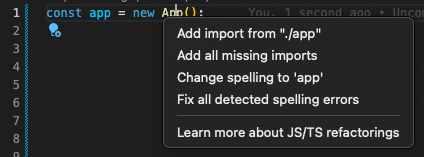
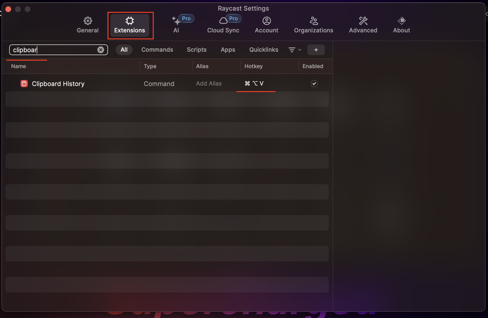

# Module 0

# Development environment

The tools you will need to effectively develop the API

## Node

Node.js is a JavaScript runtime built on Chrome's V8 JavaScript engine. This means we write our code in JavaScript/TypeScript.

Node.js should **never** be installed independently on your machine.  
Instead you should install it through [nvm (node version manager)](https://formulae.brew.sh/formula/nvm).

### NVM

Install nvm with [nvm](https://formulae.brew.sh/formula/nvm) [using homebrew](https://brew.sh/) (or [on windows](https://github.com/coreybutler/nvm-windows/releases)).

For nvm you may need to edit your shell configuration file (`.bashrc`, `.zshrc`, etc.) to load nvm.

To know your current shell run:

```bash
echo $SHELL
```

Usually, it will be `zsh`;

To edit your shell configuration file run:

```bash
vim ~/.zshrc
```

Press `i` to enter the `insert` mode and paste the following lines to the end of the file:

```bash
export NVM_DIR="$([ -z "${XDG_CONFIG_HOME-}" ] && printf %s "${HOME}/.nvm" || printf %s "${XDG_CONFIG_HOME}/nvm")"
[ -s "$NVM_DIR/nvm.sh" ] && \. "$NVM_DIR/nvm.sh" # This loads nvm
```

Then press `esc` and type `:wq` to save and exit.

_If Node.js is already installed it should be removed before installing nvm._

When the installation is completed you can simply run the following to install latest LTS node (currently 18.14.0):

```bash
nvm install --lts
```

## Package manager

Instead of the default NPM package manager we will be using [pnpm](https://pnpm.io/installation).

```bash
corepack enable
corepack prepare pnpm@latest --activate
```

## VSCode

Visual Studio Code is our preferred editor for Node.js because it's:

-   Performant
-   Customizable
-   Strong JS/TS support

Install [vscode](https://code.visualstudio.com/)

### Extensions

The following extensions will make your life a lot easier:

-   [Code Spell Checker](https://marketplace.visualstudio.com/items?itemName=streetsidesoftware.code-spell-checker)
-   [Eslint](https://marketplace.visualstudio.com/items?itemName=dbaeumer.vscode-eslint)
-   [Gitlens](https://marketplace.visualstudio.com/items?itemName=eamodio.gitlens)
-   [Prettier - Code formatter](https://marketplace.visualstudio.com/items?itemName=esbenp.prettier-vscode)
-   [Prisma](https://marketplace.visualstudio.com/items?itemName=Prisma.prisma)
-   [Mocha Test Explorer](https://marketplace.visualstudio.com/items?itemName=hbenl.vscode-mocha-test-adapter)

If the name of the extension is not clear, you can check it out in the marketplace where they are all well documented.

### Keyboard shortcuts

Making use of keyboards shortcuts can drastically increase your productivity.

Checkout [these shortcuts](https://betterprogramming.pub/15-useful-vscode-shortcuts-to-boost-your-productivity-415de3cb1910). These are the ones most developers use a lot on a daily basis.

#### Auto imports

VSCode will help you to import functions and modules automatically. There are two ways it can do this:

1. When you type a function or module name, VSCode will suggest you to import it. Like described in [their docs](https://code.visualstudio.com/docs/languages/javascript#_auto-imports)
2. The other option is to use [`cmd`]+[`.`] when your cursor is on a name that's not yet imported. But often this doesn't work without a js/tsconfig file.  
   

## Clipboard manager

You will be copying and pasting a lot of code snippets. A clipboard manager will help you to keep track of all the snippets you copy.
The easiest way to have a clipboard manager is to install [Raycast](https://www.raycast.com/)

After the installation, you need to open the app and its settings (`cmd` + `,`).
Search for the `Clipboard History` extension and add a hotkey for it (`cmd` + `shift` + `v` or `cmd` + `option` + `v`).



Copy some text and press the hotkey. You should see the text you copied in the clipboard history.


## Shell

Most of the modern computers use `zsh` as their default shell.
To enhance your experience with the terminal you can install [oh-my-zsh](https://ohmyz.sh/) and [Amazon Q](https://docs.aws.amazon.com/amazonq/latest/qdeveloper-ug/command-line-installing.html)

## Git

Use git as your version control system.  
Always commit when completing a section. Optionally you can also push to github.

If you are unfamiliar with git, you can check out [a simple git tutorial](https://phoenixnap.com/kb/how-to-use-git)
