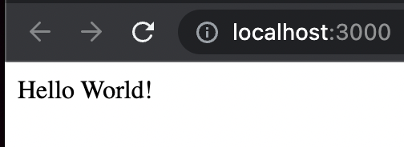
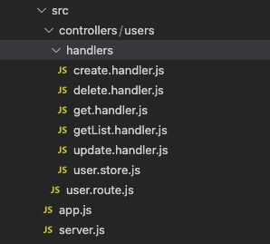
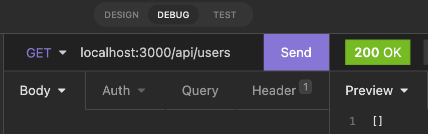
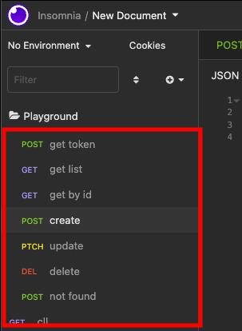
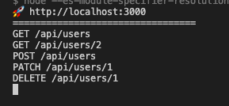
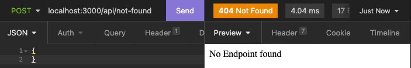
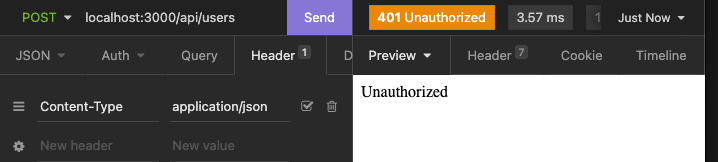
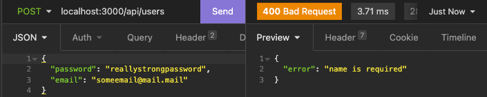

# Module 1

Throughout this course we will gradually build a Node.js Express API. As we progress elements, techniques and libraries will be added to the project.

The end goal is to build a CRUD (create, read, update, delete) controller based on [papi](https://npmjs.com/package/@panenco/papi). The way API's are built at Panenco.

# Development environment

The tools you will need to effectively develop the API

## Node

Node.js is a JavaScript runtime built on Chrome's V8 JavaScript engine. This means we write our code in JavaScript/TypeScript.

Node.js should **never** be installed independently on your machine.  
Instead you should install it through [nvm (node version manager)](https://formulae.brew.sh/formula/nvm).  
Install nvm with [nvm](https://formulae.brew.sh/formula/nvm) [using homebrew](https://brew.sh/) (or [on windows](https://github.com/coreybutler/nvm-windows/releases)).

_If Node.js is already installed it should be removed before installing nvm._

When the installation is completed you can simply run the following to install latest LTS node (currently 18.14.0):

```bash
nvm install --lts
```

## Yarn

Instead of the default NPM package manager we will be using [Yarn](https://yarnpkg.com/getting-started).

```bash
brew install yarn
```

## VSCode

Visual Studio Code is our preferred editor for Node.js because it's:

- Performant
- Customizable
- Strong JS/TS support

Install [vscode](https://code.visualstudio.com/)

### Extensions

The following extensions will make your life a lot easier:

- [Code Spell Checker](https://marketplace.visualstudio.com/items?itemName=streetsidesoftware.code-spell-checker)
- [Eslint](https://marketplace.visualstudio.com/items?itemName=dbaeumer.vscode-eslint)
- [Gitlens](https://marketplace.visualstudio.com/items?itemName=eamodio.gitlens)
- [Prettier - Code formatter](https://marketplace.visualstudio.com/items?itemName=esbenp.prettier-vscode)
- [Mocha Test Explorer](https://marketplace.visualstudio.com/items?itemName=hbenl.vscode-mocha-test-adapter)
- [Typescript Hero](https://marketplace.visualstudio.com/items?itemName=rbbit.typescript-hero)

If the name of the extension is not clear, you can check it out in the marketplace where they are all well documented.

### Keyboard shortcuts

Making use of keyboards shortcuts can drastically increase your productivity.

Checkout [these shortcuts](https://betterprogramming.pub/15-useful-vscode-shortcuts-to-boost-your-productivity-415de3cb1910). These are the ones most developers use a lot on a daily basis.

#### Auto imports

VSCode will help you to import functions and modules automatically. There are two ways it can do this:

1. When you type a function or module name, VSCode will suggest you to import it. Like described in [their docs](https://code.visualstudio.com/docs/languages/javascript#_auto-imports)
2. The other option is to use [`cmd`]+[`.`] when your cursor is on a name that's not yet imported. But often this doesn't work without a js/tsconfig file.  
   

## Git

Use git as your version control system.  
Always commit when completing a section. Optionally you can also push to github.

If you are unfamiliar with git, you can check out [a simple git tutorial](https://phoenixnap.com/kb/how-to-use-git)

# Before you get started

Almost time to dive in!

Since we won't be diving very deep into the basics of Node.js or Express it can be useful for inexperienced developers to checkout a [Node.js course](https://www.udemy.com/course/the-complete-nodejs-developer-course-2/) on Udemy.

It's a great course covering all the basics. Some sections are more interesting than others for our purposes.

The most interesting sections are:

- 3 - Node.js Module System (Notes App)
- 6 - Asynchronous Node.js (Weather App)
- 7 - Web Servers (Weather App)
- 9 - Application Deployment (Weather App)
- 11 - REST APIs and Mongoose (Task App)
- 13 - Sorting, Pagination, and Filtering (Task App)

Rather than explicitly watching the entire course up front I would recommend to find a section that is of interest whenever something is not clear to you.

# Basic NodeJS express API

[Express](https://expressjs.com/) is a fast and small Node.js web framework. We will be using express to serve our API and define our routes.

The first step is to create a very small example API to get a hold of some main express routing concepts.

## Init new node project

1. Create a new directory and open it in vscode
2. Open the terminal and run the following command:

   ```bash
   yarn init
   ```

3. Now answer the questions:
   1. name: `panenco-node-course`
   2. version: keep the default, press enter to continue
   3. description: `Panenco Node Course API`
   4. entry point: `src/server.js`
   5. ... keep the default, press enter to continue for all remaining questions
4. Add express as a dependency to the project:

   ```bash
   yarn add express
   ```

5. Add files

   - `src/app.js`  
      Create a class to initialize a `host` (express app) in the constructor and add a method to start listening on port 3000.  
      That should give you something like this:

     ```js
     // src/app.js
     import express from 'express';

     export class App {
       constructor() {
         // Init server
         this.host = express();
       }

       listen() {
         this.host.listen(3000, () => {
           console.info(`🚀 http://localhost:3000`);
           console.info(`========================`);
         });
       }
     }
     ```

   - `src/server.js`  
      This is actually just a simple, almost empty entrypoint that will be starting initializing the app class.
     It should look like this:

     ```js
     // src/server.js
     import { App } from './app.js';

     const app = new App();
     app.listen();
     ```

   - Running the server  
      Add an NPM script in the package.json that runs the server:

     ```jsonc
     // package.json
     "scripts": {
        "start": "node src/server.js"
     },
     ```

     Now you can run the server by simply executing `yarn start` from your terminal.

     Since we are using ES6 syntax this won't work and you'll get an error on the first import statement when running this. To fix this we need to allow ES6 syntax by modifying the package.json a bit. Add `type`=`module` as a property in the package.json and specify the `es-module-specifier-resolution` option to `node` in the start script.

     ```jsonc
     // package.json
     "scripts": {
        "start": "node --es-module-specifier-resolution=node src/server.js"
     },
     "type": "module",
     ```

     Currently this is quite useless though as we don't have any API code to run yet.

## Nodemon

Normally on every code change you'd have to stop and run the start command again so the code would be recompiled. We use nodemon to watch for code changes and restart the server whenever something changes. More info on nodemon can be found [here](https://blog.logrocket.com/configuring-nodemon-with-typescript/)

```bash
yarn add -D nodemon
```

### Add a dev command in package.json

```jsonc
// package.json
"scripts": {
    "start": "node --es-module-specifier-resolution=node src/server.js",
    "dev": "nodemon --es-module-specifier-resolution=node src/server.js"
},
```

## First endpoint

With express it's very easy to create a simple endpoint.

The host in app.js has methods to define a route. Add a `get` route on the root. You can simply define it in the **constructor** of `App`.

The handler (callback) can be called with 3 arguments. `request`, `response` and `next`. Use the response to `send` a "Hello world" string when the route is hit.

```js
this.host.get('/', (req, res, next) => {
  res.send('Hello World!');
});
```

Rerun the server and visit `http://localhost:3000/`.  


To learn more about this checkout the Udemy course on [section 7 - 43. Hello Express!](https://www.udemy.com/course/the-complete-nodejs-developer-course-2/learn/lecture/13729022#overview)

## CRUD endpoints

CRUD endpoints (create, read, update, delete) are the most common type of endpoint, definitely for a REST API.

Let's build sample CRUD endpoints for users.

Instead of extending app.js infinitely you should create a maintainable structure.

- `src/controllers` (holds all routes and handlers)
  - `src/controllers/users` (or any other CRUD) - `src/controllers/users/user.route.js` (the route definition) - `src/controllers/users/handlers` (the handlers, logic to be executed by the routes)

To simply create everything you can run the following commands:

```bash
mkdir src/controllers
mkdir src/controllers/users
mkdir src/controllers/users/handlers
touch src/controllers/users/handlers/create.handler.js
touch src/controllers/users/handlers/delete.handler.js
touch src/controllers/users/handlers/get.handler.js
touch src/controllers/users/handlers/getList.handler.js
touch src/controllers/users/handlers/update.handler.js
touch src/controllers/users/handlers/user.store.js
touch src/controllers/users/user.route.js
```

Then you have a result like this:  


### Endpoint structure

First create the get all users route.

1. Define a class `UserRoute` in `user.route.js`
2. Initialize a root path and new instance of express `Router`
3. Add a `get` route to the `Router` with the following handler:

   ```js
   router.get('/', (req, res, next) => {
     res.send('Get all users');
   });
   ```

4. Now create a handler (exported arrow function) `getList.js` in the handlers folder with the same middleware code as previously written in the route.
5. Replace the inline middleware with a reference to the handler.

As a result you should have something like this:

```js
// user.route.js
import { Router } from 'express';
import { getList } from './handlers/getList.handler';

export class UserRoute {
  constructor() {
    this.router = Router();
    this.path = 'users';

    this.router.get('/', getList);
  }
}
```

```js
// handlers/getList.handler.js
export const getList = async (req, res, next) => {
  res.send('Get all users');
};
```

The only thing left is to actually use the route in `app.js`. Currently it's only defined but not yet initialized when starting the application.

1. Create a new instance of the class `UserRoute` in the constructor of `App`
2. Use the `router` property to add the route to the host

```js
const usersRoute = new UserRoute();
this.host.use(`/api/${usersRoute.path}`, usersRoute.router);
```

When rerunning the server you should be able to visit `http://localhost:3000/api/users` and see the response.

### User store

Instead of using a database, to keep things simple in the beginning, we will be using an in memory store. Since it's just a temporary solution we won't be going into detail about how to implement it.

You can just open the details pane below and copy paste the code into `src/controllers/users/handlers/user.store.js`

<details>
   <summary>Show Code</summary>

```js
export class UserStore {
  static users = [];

  static get(id) {
    return this.users.find((user) => user.id === Number(id));
  }

  static getByEmail(email) {
    return this.users.find((user) => user.email === email);
  }

  static find(search = undefined) {
    return this.users.filter(
      (user) => !search || Object.values(user).some((value) => value?.toString().includes(search))
    );
  }

  static add(user) {
    const u = { ...user, id: this.users.length };
    this.users.push(u);
    return u;
  }

  static update(id, input) {
    const current = this.get(id);
    const user = { ...current, ...input };
    this.users.splice(
      this.users.findIndex((x) => x === current),
      1,
      user
    );
    return user;
  }

  static delete(id) {
    this.users.splice(
      this.users.findIndex((x) => x.id === Number(id)),
      1
    );
  }
}
```

</details>

Use the `UserStore` in the getList handler and pass the result as a json response.

```js
const users = UserStore.find();
res.json(users);
```

```js
const users = UserStore.find('<name>');
res.json(users); // returns all users with name containing <name>
```

### Testing

#### Insomnia

[Insomnia](https://insomnia.rest/) is a tool to test your API and manually call endpoints. Similar to Postman but a little bit easier and faster to use. It allows you to send requests by entering a URL, body, query parameters and headers.

1. Install Insomnia
2. Rerun app
3. Add a request to test `GET /api/users`  
   This should give you an empty json array



You can easily save a request for each endpoint or test you want to do, like this:  


From now on test each change you make with Insomnia after rerunning the server.

#### Automated testing

For simplicity, We limit testing our functionality to manual testing through Insomnia for now. Relying solely on manual testing is insufficient, so in the next part (Module 2) we will dive deeper into automated testing using Mocha.

### JSON Body

Lets add a basic user creation endpoint.

1. Add a new handler `create.handler.js` to the handlers folder.
   - The body will be located on `req.body`
   - Pass the body to `UserStore.add` to create a new user.
   - Set the result as a json response.
2. Add a new route `post` to the `UserRoute` class that uses this handler.

```js
// create.handler.js
import { UserStore } from './user.store';

export const create = async (req, res, next) => {
  const user = UserStore.add(req.body);
  res.json(user);
};
```

```js
// user.route.js
this.router.post('/', create);
```

When you try out this endpoint with a JSON body now you'll get an error because express doesn't know how to parse the body yet.
To fix this you can add some built in middleware to parse the body. We'll talk about middleware later.

To enable it add the `express.json` middleware at the **beginning** of the constructor of `App`.

```js
this.host.use(express.json());
```

When you try out the endpoint again you should get a success response.

### Remaining CRUD operations

There are 2 concepts we didn't talk about yet which you will need to complete the rest of the CRUD operations.

1. Query parameters
   To use queryparams you can use the request in the handler like you would do with the body

   `example-api.panenco.com?search=<somevalue>` would translate to

   ```js
   req.query.search; // = <somevalue>
   ```

   The Udemy course has a great explenation on this topic in [Section 8 - 54. The Query String](https://www.udemy.com/course/the-complete-nodejs-developer-course-2/learn/lecture/13729060#overview)

2. Path parameters
   To use path parameters you can use the request in the handler like you would do with the body but you need to use the `:` symbol to indicate the parameter in the route.

   ```js
   this.router.get('/:id', get);
   ```

   `example-api.panenco.com/<someId>` would translate to

   ```js
   req.params.id; // = <someId>
   ```

Add the following endpoints:

- `GET /api/users/:id` - get a user by id
- `PATCH /api/users/:id` - update a user by id
- `DELETE /api/users/:id` - delete a user by id

Once that's working we can add a few small things:

- `GET /api/users/:id`
  Validate if the user exists. If not return a 404 with a JSON error message.
- `GET /api/users`
  Use the search query param to filter the users.
- `POST /api/users`
  Validate if the user's name has been provided and if not return a 400 with a JSON error message.

<details>
<summary>Spoiler alert > View the result</summary>

```js
// user.route.js
import { Router } from 'express';

import { create } from './handlers/create.handler';
import { deleteUser } from './handlers/delete.handler';
import { get } from './handlers/get.handler';
import { getList } from './handlers/getList.handler';
import { update } from './handlers/update.handler';

export class UserRoute {
  constructor() {
    this.router = Router();
    this.path = 'users';

    this.router.post('/', create);
    this.router.get('/', getList);
    this.router.get('/:id', get);
    this.router.patch('/:id', update);
    this.router.delete('/:id', deleteUser);
  }
}
```

```js
// create.handler.js
import { UserStore } from './user.store';

export const create = async (req, res, next) => {
  if (!req.body.name) {
    // Set the status of the response and send the error message
    return res.status(400).json({
      error: 'name is required',
    });
    // We don't want to continue if the name is missing. So we return here.
  }
  const user = UserStore.add(req.body);
  res.json(user);
};
```

```js
// delete.handler.js
import { UserStore } from './user.store';

export const deleteUser = async (req, res, next) => {
  const user = UserStore.get(req.params.id);
  // Duplicated in multiple places for now. This will be refactored later.
  if (!user) {
    return res.status(404).json({ error: 'User not found' });
  }
  UserStore.delete(req.params.id);
  res.status(204);
  res.send();
};
```

```js
// get.handler.js
import { UserStore } from './user.store';

export const get = async (req, res, next) => {
  const user = UserStore.get(req.params.id);
  if (!user) {
    res.status(404).json({ error: 'User not found' });
    return;
  }
  res.json(user);
};
```

```js
// getList.handler.js
import { UserStore } from './user.store';

export const getList = async (req, res, next) => {
  const users = UserStore.find(req.query.search);
  res.json(users);
};
```

```js
// update.handler.js
import { UserStore } from './user.store';

export const update = async (req, res, next) => {
  const user = UserStore.get(req.params.id);
  if (!user) {
    res.status(404).json({ error: 'User not found' });
    return;
  }
  const updated = UserStore.update(req.params.id, req.body);
  res.json(updated);
};
```

</details>

## Middleware

Middleware is the absolute core of express. Endpoints consist of mainly only middleware.
For instance:

- `express.json` we added before is middleware that parses the json body for us.
- Each handler we added is middleware.

Currently we only have these but we can add middleware for whatever we need, like authentication, logging, error handling or validation.

Middleware can be applied within a few different scopes:

- General: applied to all endpoints, configured in `App` on the express host
- Router: applied on all endpoints within a router, configured in the `*.route.js` files on the router instance.
- Endpoint: applied only to the specified endpoint. Configured when defining the endpoint.

The **order** of middleware is very important.  
The first middleware that's applied will be the first one that's called. If we would move the `express.json` middleware below the initialization of the `UserRoute` class the body would only be available after the handler would have called the `next` function.  
In our examples currently the handler is always the last middleware to be called as no `next` function is called and a response is sent.

That's about the basics of express middleware. Checkout the [express middleware documentation](https://expressjs.com/en/guide/using-middleware.html) for a bit more detailed information.

The Udemy course also has a section dedicated to middleware: [Section 12 - 108. **Express Middleware**](https://www.udemy.com/course/the-complete-nodejs-developer-course-2/learn/lecture/13729298#overview)

If this is all still a little bit unclear I really recommend you learn more about middleware.

### General before middleware

Let's add some general middleware that runs before all endpoints.

A use case for this would be the `express.json` middleware we already have in place. Or a logger that logs the url and the method for each request, so let's add that.

To do so, call the `use` function on the express host in `App` before the `UserRoute` is initialized.

When you call endpoints now you should see something like this:  


Code:

```js
this.host.use((req, res, next) => {
  console.log(req.method, req.url);
  next();
});
```

### General after middleware

Use cases for general after middleware are quite limited. Before we talked about how the order of middleware is important and the next middleware will be called after the `next` function is called. However in the handlers we don't call the `next` function. Instead we return a response. So currently if we add a general after middleware it will never be hit.

That leaves us only 1 option, a middleware for undefined routes: 404 Not Found error middleware.

Add the 404 middleware in `App` after the `UserRoute` is used. Send a 404 response with some error message.


Code:

```js
this.host.use((req, res, next) => {
  res.status(404).send('No Endpoint found');
});
```

### Endpoint specific before middleware

Whenever you want to execute some code before an endpoint is called, you can add middleware for it.  
For instance if you want to check if the user is authenticated before calling the endpoint.

The easiest (not really secure) way to validate access is to check the request for a fixed value. Requests can hold headers, like an `x-auth` header.

- Add an arrow function at the top of `user.route.js` with the same arguments as the other middleware, give it the name `adminMiddleware`.
- In the function body check if the `x-auth` header matches a certain value.
- If not, send a 401 response with a message.
- Otherwise call the `next` function
- Now add the middleware to the post route as a third argument before the handler.

That's it, when calling the create user endpoint without the `x-auth` header set to your value you should get a 401 response.


Code:

```js
const adminMiddleware = (req, res, next) => {
  if (req.header("x-auth") !== "api-key") {
    return res.status(401).send("Unauthorized");
  }
  next();
};

...

this.router.post("/", adminMiddleware, create);
```

### General error middleware

When defined error middleware will be called when previously the `next` function has been called with a parameter. Instead of 3 arguments error handling middleware has 4. The first argument is the error object. The others are the same as regular middleware.

More info in the [express docs](https://expressjs.com/en/guide/using-middleware.html#middleware.error-handling).

You need to build 2 things:

1. The actual middleware

- Add middleware at the end of the constructor in `App` with the 4th argument `(error, req, res, next)`
- Set response status to 400 and send the error as json response.

2. Add an error to handle
   - Before we would have sent the error response directly from the handler. Now we can reuse the error handler
   - In the create handler you should already have some validation in place. So you can simply replace `res.status(400).json` with `next` and the error will be handled by the error middleware.
   - Make sure to return so the remaining code of your handler is not executed



Code:

```js
// app.js
this.host.use((error, req, res, next) => {
  res.status(400).json(error);
});
```

```js
// create.handler.js
if (!req.body.name) {
  return next({
    error: 'name is required',
  });
}
```
