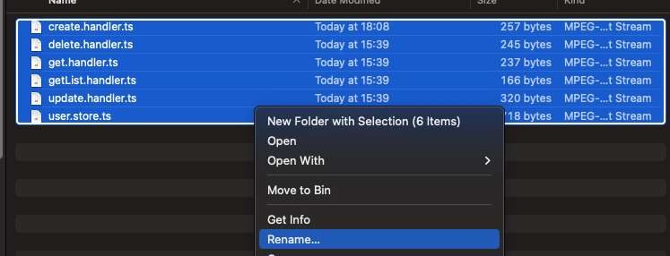
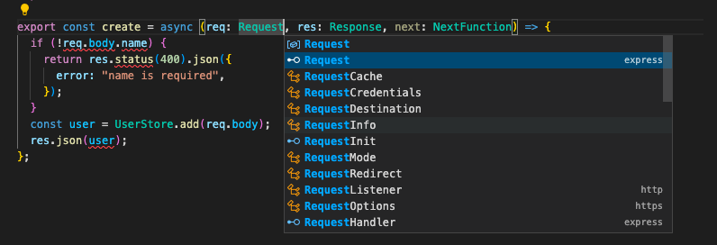
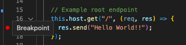
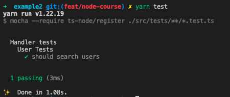
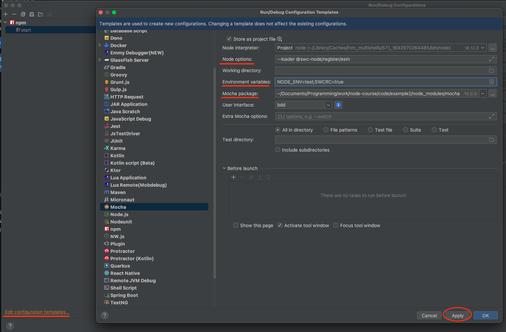
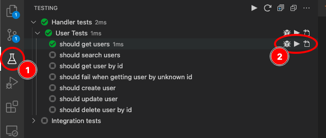
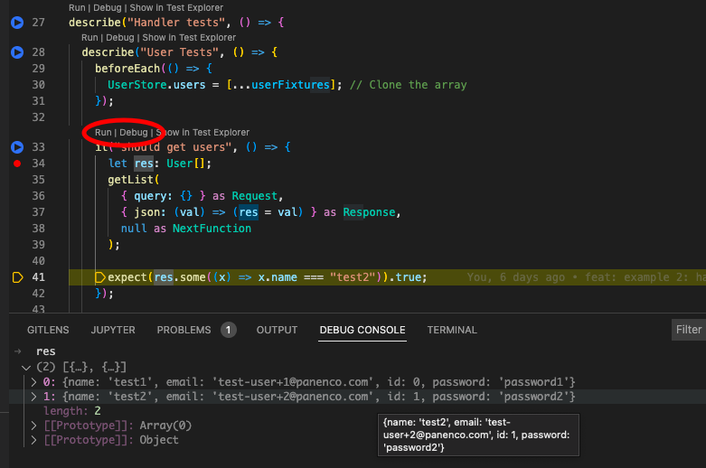

# Module 2

In the first module we focused mainly on the basics of node and express. In this
second module we'll be adding some aspects to our code to make it more scalable
and maintainable. We will:

- Convert the app from Javascript to Typescript for type safety.
- Add validation on our input and output.
- Add tests that cover the application code & functionality.

# Typescript

## Intro

Typescript is a superset of Javascript which allows for optional static typing.
It is designed for the development of large applications and transpiles to
JavaScript. Typescript technically is Javascript with static types.

Why would we add static typing to Javascript? We'll explain using a simple
example:

```js
// Javascript example
const printCourse = (course) => console.log(course.title);
printCourse({ name: "node course" });
```

There's an obvious error here. The function expects there is a 'title' property
on the course object that's being passed. But in reality only a 'name' property
is being passed. Because of the lack of type safety this will only be noticed
when the code actually runs.

```ts
// Typescript example
type Course = {
	title: string;
}

const printCourse = (course: Course): void => console.log(course.title);
// Error would be highlighted on the line below
printCourse({name: "node course"});
```

```
Argument of type '{ name: string; }' is not assignable to parameter of type 'Course'.
  Object literal may only specify known properties, and 'name' does not exist in type 'Course'.
```

With TypeScript we can define a type which the function expects the course param
to be in line with. If that's not the case an error will be shown to the
developer and the code will not compile. This makes it much safer because the
developer is unable to make this mistake.

More on Typescript and why it's better than plain javascript can be
found [in this easy-to-read article](https://serokell.io/blog/why-typescript)

## Adding the Typescript NPM packages

```bash
pnpm add -D typescript @types/node @types/express
```

> Note!
> Your @types/node major version (first number in semver x.x.x) should match
> your current node version.
> You can check your node version by running `node -v` in your terminal.
> So, if you use node 18, you should have "@types/node": "18.x.x"

## Initialize typescript with a tsconfig.json

```bash
touch tsconfig.json
```

```jsonc
{
	"compilerOptions": {
		"target": "esnext",
		"experimentalDecorators": true,
		"emitDecoratorMetadata": true,
		"module": "esnext",
		"moduleResolution": "nodenext",
		"allowJs": true,
		"sourceMap": true,
		"isolatedModules": true,
		"allowSyntheticDefaultImports": true,
		"esModuleInterop": true,
		"forceConsistentCasingInFileNames": true,
		"skipLibCheck": true
	}
}
```

## Transpiling

TypeScript is not the first-class citizen in Node.js.
The Node.js runtime only expects JavaScript.
Consequently, we need to transpile the TypeScript code to JavaScript.
This can be done via SWC (Speedy Web Compiler)

Installation

```shell
pnpm add -D  @swc/cli @swc/core @swc/helpers  @swc-node/register chokidar 
```

## Configure swc

create a `.swcrc` file in the root of the project with the following content

```json
{
	"$schema": "https://json.schemastore.org/swcrc",
	"jsc": {
		"parser": {
			"syntax": "typescript",
			"decorators": true
		},
		"target": "es2022",
		"loose": false,
		"minify": {
			"compress": false,
			"mangle": false
		},
		"transform": {
			"legacyDecorator": true,
			"decoratorMetadata": true
		}
	},
	"module": {
		"type": "es6"
	},
	"minify": false,
	"isModule": true,
	"sourceMaps": true
}
```

## Convert all files to .ts extension

Either by using finder or just do it one by one in VSCode



This will basically break everything, step by step fix all errors in every file.

## UserStore

Since the user store is a provided utility you don't need to transform it to
typescript by yourself, just copy paste the included code below. You can have a
look at what changed in there so you get a better idea of what to do for the
other files.

<details>
<summary>user.store.ts</summary>

```ts
export type User = {
	id: number;
	name: string;
	email: string;
	password: string;
};

export class UserStore {
	static users: User[] = [];

	static get(id: number): User | undefined {
		return this.users.find((user) => user.id === id);
	}

	static getByEmail(email: string): User | undefined {
		return this.users.find((user) => user.email === email);
	}

	static find(search?: string): User[] {
		return this.users.filter(
			(user) => !search || Object.values(user).some((value) => value?.toString().includes(search))
		);
	}

	static add(user: Omit<User, 'id'>): User {
		const u = {...user, id: this.users.length};
		this.users.push(u);
		return u;
	}

	static update(id: number, input: User): User {
		const current = this.get(id);
		const user = {...current, ...input};
		this.users.splice(
			this.users.findIndex((x) => x === current),
			1,
			user
		);
		return user;
	}

	static delete(id: number) {
		this.users.splice(
			this.users.findIndex((x) => x.id === id),
			1
		);
	}
}
```

</details>

## Add types where needed

**One caveat here**: Typescript will already know `Request` and `Response` so it
will see it as already imported, place your cursor at the end of the type and
press `ctrl + space` to suggest imports. Pick the express one instead of the
default type. NextFunction and other imports will be easily done by
pressing `CMD + .` and choosing 'Add all missing imports' / 'Add import
from ...'



If this is not working correctly for you, try to reload your
window (`[cmd + shift + p]` => `Developer: Reload window`) so vscode picks up
your typescript changes.

Example of converted handler:

```ts
// controllers/users/handlers/create.handler.ts
import { NextFunction, Request, Response } from 'express';

import { UserStore } from './user.store.js';

export const create = async (req: Request, res: Response, next: NextFunction) => {
	if (!req.body.name) {
		return res.status(400).json({
			error: 'name is required',
		});
	}
	const user = UserStore.add(req.body);
	res.json(user);
};
```

In `app.ts` you have a property that's less straightforward to type, the `host`.
This is exposed by express as `Application`.

## Adjust scripts in package.json

```shell
pnpm add -D concurrently
```

```jsonc
// package.json
"scripts": {
	"build": "swc src --out-dir build",
	"build:clean": "rm -rf build && pnpm run build",
	"watch": "swc src -d build --watch",
	"start": "node build/server.js",
	"dev": "concurrently 'pnpm run watch' 'node --watch build/server.js'",
	"test": "SWCRC=true NODE_OPTIONS='--loader @swc-node/register/esm' mocha ./src/tests/**/*.test.ts"
},
```

Start the server in the `dev` mode to see if everything is OK. At this point,
you probably won't
have fixed everything yet. Go through the errors the compiler shows and fix them
one by one until your server is working again.

Make sure all files are renamed to .ts extension,
event `server.js`, `app.js`,...

```bash
pnpm dev 
```

## VSCode debugger

Debugging your code is a very important aspect when developing web applications.
It allows you to place breakpoints in your code and stop the code at a certain
point to look at the value of parameters and other important stuff.

To enable debugging add a `launch.json` file in a new `/.vscode` directory. This
new directory should exist in your project root, not in src.

```jsonc
{
  // /.vscode/launch.json
  // Use IntelliSense to learn about possible attributes.
  // Hover to view descriptions of existing attributes.
  // For more information, visit: https://go.microsoft.com/fwlink/?linkid=830387
  "version": "0.2.0",
  "configurations": [
    {
      "request": "launch",
      "name": "Dev",
      "skipFiles": ["<node_internals>/**"],
      "command": "pnpm dev",
      "type": "node-terminal"
    }
  ]
}
```

To start a debugging session press F5 or fn + F5 (depending on your keyboard
configuration).

Now place a breakpoint in `app.ts` on line 17 and run visit the root url of your
application. You will be able to hover over parameters and see what value they
have at runtime. Any time you have an error you can use this to easily find a
solution and know what's actually going on.



# Class validator & Class Transformer

## Intro

class-transformer allows you to transform plain objects (json input object for
example) to an instance of a class. This is very helpful because we can define
these classes in the way we want to work with them and this way they are much
more useful compared to plain objects. There's a ton of other things you can do
with class-transformer as explained in
their [docs](https://github.com/typestack/class-transformer)

class-validator allows us to validate objects. It does this with the help of
decorators. more about class-validator specifically in
their [docs](https://github.com/typestack/class-validator)

Add the packages

```bash
pnpm add -D class-transformer class-validator
```

## Decorators

A Decorator is a special kind of declaration that can be attached to a class
declaration, method, accessor, property, or parameter. Decorators use the form
@expression , where expression must evaluate to a function that will be called
at runtime with information about the decorated declaration.

Both class-validator and class-transformer make heavy use of these decorators to
add meta-data which is used while transforming and validating objects.

As decorators are still an experimental feature in Typescript (they have been
around for years) we have to explicitly enable them:

Uncomment these lines in tsconfig.json

```jsonc
"experimentalDecorators": true,
"emitDecoratorMetadata": true,
```

And set these to false to make Typescript a bit less strict

```jsonc
"strictPropertyInitialization": false, /* Check for class properties that are declared but not set in the constructor. */
"strict": false /* Enable all strict type-checking options. */,
```

## Explicit validation

1. First add a UserBody class which we'll use to transform and validate our
   input when creating a user. Put this in a `src/contracts` folder. and name
   the file `user.body.ts`

```ts
//user.body.ts

import { Exclude, Expose } from 'class-transformer';
import { IsEmail, IsString, Length } from 'class-validator';

// For safety we'll exclude everything from being transformed by placing a @Exclude() decorator on the class declaration
@Exclude()
export class UserBody {
	// We can expose the properties we want included one by one
	@Expose()
	@IsString()
	public name: string;

	@Expose()
	// We can start adding validation decorators that specify exactly what we expect from the object we will be validating
	@IsEmail()
	public email: string;

	@Expose()
	@IsString()
	@Length(8)
	public password: string;
}
```

2. Now add some code to `create.handler.ts` to transform and validate the input
   body

```ts
// transform the plain object to an instance of our UserBody class using the plainToInstance function from the class-transformer package
const transformed = plainToInstance(UserBody, req.body);
// now validate the transformed object and retrieve possible errors
const validationErrors = await validate(transformed, {
	skipMissingProperties: false,
	whitelist: true,
	forbidNonWhitelisted: true,
});
// if errors were found pass them to the express NextFunction and express will skip any remaining non-error handling middleware and output these errors as the response.
if (validationErrors.length) {
	return next(validationErrors);
}
const user = UserStore.add(transformed);
```

3. Try it out by using the POST `/api/users` endpoint with both a valid and an
   invalid JSON body. also feel free to play around with the different
   decorators to add more advanced validation for example.
   > Note: If this produces a 500 instead of a 400 for you, you probably have an
   issue with your error handling middleware in `app.ts`

## Explicit representation

1. First add a UserView class which we'll use to transform our output before
   returning a response. Put this in a `contracts` folder. and name the
   file `user.view.ts`

```ts
import { Exclude, Expose } from 'class-transformer';
import { IsEmail, IsNumber, IsString } from 'class-validator';

@Exclude()
export class UserView {
	// If we want to exclude this id property for example we can just omit it from the class or explicitly place a @Exclude() decorator on the property.
	@Expose()
	@IsNumber()
	public id: number;

	@Expose()
	@IsString()
	public name: string;

	@Expose()
	@IsEmail()
	public email: string;
}
```

2. Now replace the last line in `create.handler.ts` to transform the user object

```ts
res.json(plainToInstance(UserView, user));
```

## View/Body Middleware

Off course to make our code reusable and clean you don't want to put the logic
above in each handler where it would be needed. We can make use of express
middleware again to separate this. This is still a very simplistic approach as
the `UserBody` and `UserView` are hardcoded into the middleware. eventually
we'll make this more flexible as we go.

1. Add these functions to `user.route.ts`

```ts
const patchValidationMiddleware = async (req: Request, res: Response, next: NextFunction) => {
	const transformed = plainToInstance(UserBody, req.body, {
		// undefined properties not taken into account
		exposeUnsetFields: false,
	});
	const validationErrors = await validate(transformed, {
		// missing properties not validated -> we wouldn't want this when creating an entity for example
		skipMissingProperties: true,
		whitelist: true,
		forbidNonWhitelisted: true,
	});
	if (validationErrors.length) {
		return next(validationErrors);
	}
	req.body = transformed;
	next();
};
```

```ts
const representationMiddleware = async (req: Request, res: Response, next: NextFunction) => {
	const transformed = plainToInstance(UserView, res.locals.body); // Note the use of res.locals here. Locals is a way to transport data from one middleware to another.
	res.json(transformed);
};
```

2. Apply it to the patch user route

```ts
this.router.patch(
	'/:id',
	// first transform and validate
	patchValidationMiddleware,
	// handle actual logic
	update,
	// finally transform the output
	representationMiddleware
);
```

3. Update the handler

```ts
// update.handler.ts
import { NextFunction, Request, Response } from 'express';

import { UserStore } from './user.store.js';

export const update = (req: Request, res: Response, next: NextFunction) => {
	const id = Number(req.params.id);
	const user = UserStore.get(id);
	if (!user) {
		return res.status(404).json({error: 'User not found'});
	}
	const updated = UserStore.update(id, req.body);
	res.locals.body = updated; // Set the result on the locals object to pass it to the representation middleware.
	next(); // call next so the representation middleware is actually fired
};
```

4. Try it out by using the PATCH `/api/users/:id` endpoint with both a valid and
   an invalid JSON body.

# Automated Testing

Testing is one of the most important aspects of the development process. It's
how we develop fast and reliable applications.

Automated tests are great for a number of reasons:

- Reduce risk on regression
- Easy to validate new features (It's usually quicker to write a few tests than
  to manually test a feature)
- Provides extra insights on the feature (For reviews, frontend developers,
  future modifications)
- It makes you think a second time about what you are building and you might
  find a better way to do it
- Easily integrated into CI/CD pipelines
- ...

## Testing guidelines

- Always write a test to validate code before manually testing a feature.
- Test functional flows as integration tests
- Test all code paths
- Test all possible error cases
- Always try to achieve 100% test coverage
- Write meaningful assertions
- Always mock external dependencies/integrations
- Build robust tests, tests should remain valid when fixture data is extended
	- Don't validate database counts
	- Validate behavior instead of explicit data
	- Try to, when it makes sense, create new fixtures for new features

### Handler tests guidelines

Handler tests are the tests covering most of your application by executing
handlers directly from tests. They test a single handler with a specified input
set where the output has to match the expected result. For one handler (
endpoint) there usually should be multiple tests.

- Test all handlers
- Add multiple tests for one handler
- Test all possible scenarios for a single handler

### Integration tests guidelines

Integration tests are tests that execute endpoints and test complete flows. The
entire application is bootstrapped and the endpoints are served by a testing
framework.

- Each endpoint should be at least tested once
- Verify all possible middleware code, code that can't be reached from a handler
  test
- Test happy flows

## Setting up Mocha

[Mocha](https://mochajs.org/) is a very easy to use testing framework we will be
using to define and run our tests.

### Adding the Mocha NPM packages

```bash
pnpm add -D mocha @types/mocha
```

### Test command in package.json

```jsonc
// package.json
"test": "SWCRC=true NODE_OPTIONS='--loader @swc-node/register/esm' mocha ./src/tests/**/*.test.ts"

```

When running the command now you'll get a message stating no tests were found
because we haven't added any tests yet.

### Assertions with chai

Assertions are the way to check the output and verify that what is returned is
actually expected. The notation of these assertions we do
with [chai](https://www.npmjs.com/package/chai).

Check their [usage docs](https://www.npmjs.com/package/chai#usage) for all
possibilities.

Add chai:

```bash
pnpm add -D chai @types/chai
```

The most straightforward assertion is to check if a value is equal to a fixed
value, like this:

```ts
expect(res.email).equal('test-user+2@panenco.com');
```

### Mocha test file structure

There are 2 main concepts to create a structure in a test file:

- describe: A group of tests that share the same name.
- it: The test itself

Within the describe block we can implement a few functions:

- beforeEach: A function that is executed before each test.
- afterEach: A function that is executed after each test.
- before: A function that is executed before the first test in the group.
- after: A function that is executed after the last test in the group.

So with those tools you can create a test file like this:

```ts
describe('Handler tests', () => {
	describe('User Tests', () => {
		beforeEach(() => {
			console.log('beforeEach');
		});

		it('should test absolutely nothing', () => {
			expect(true).true;
		});
	});
});
```

Add this sample to `src/tests/handlers/user.handler.test.ts`.

## Fixtures

In actual applications we will always have a database and a ton of utilities to
build and manage our test data. Since we are building minimalistic examples here
we do the same for the fixtures.

Simply create a list of users and clone that list before every test
into`UserStore.users`

```ts
const userFixtures: User[] = [
	{
		name: 'test1',
		email: 'test-user+1@panenco.com',
		id: 0,
		password: 'password1',
	},
	{
		name: 'test2',
		email: 'test-user+2@panenco.com',
		id: 1,
		password: 'password2',
	},
];

describe('Handler tests', () => {
	describe('User Tests', () => {
		beforeEach(() => {
			UserStore.users = [...userFixtures]; // Clone the array
		});
	});
});
```

Extend `user.handler.test.ts` with the fixtures.

## Adding handler tests

As [previously mentioned](#handler-tests-guidelines), multiple handler tests
should be created for each handler to test all possible scenarios. That means
you should create a test for each code path, each if, else, etc.

### Test get user list

Since we are using plain express handlers for our handlers we will need to apply
some mocking techniques to pass in the data and get the result.

For instance, the handler expects a `search` queryparam in the request object.
We can pass it in like this:

```
getList({query: {search: "test1"}} as Request, ...)
```

A little more difficult is to get the json result back. For this we need to
define a `let` variable that we set when `res.json` is called. Like this:

```
let res: User[];
getList(
	...,
	{json: (val) => (res = val)} as Response
);
```

So putting that all together and adding an assertion to check if the result
contains a specified user we end up with this:

```ts
it('should search users', () => {
	let res: User[];
	getList(
		{query: {search: 'test1'} as any} as Request,
		{json: (val) => (res = val)} as Response,
		null as NextFunction
	);

	expect(res.some((x) => x.name === 'test1')).true;
});
```

Now you can finally run the `pnpm test` command you previously added.  


### Test all handlers and scenarios

Now you've learned the tools to create handler tests it's up to you. Create
tests for all handlers and all scenarios.

Make sure to add meaningful assertions to your tests.

To help you a bit, here is a list of tests I ended up with:

- should get users
- should search users
- should get user by id
- should fail when getting user by unknown id
- should create user
- should update user
- should delete user by id

## Adding integration tests

In integration tests the actual endpoints are executed while the server is "
running". To achieve this we need to use the `supertest` library.

### Supertest

Add the packages:

```bash
pnpm add -D supertest @types/supertest
```

Instead of actually running the server and listening on a certain port. We pass
the express host to supertest. That way we can call all endpoints from the
returned request.

```ts
// src/tests/integration/user.integration.test.ts

// bootstrapping the server with supertest
describe('Integration tests', () => {
	describe('User Tests', () => {
		let request: supertest.SuperTest<supertest.Test>;
		beforeEach(() => {
			const app = new App();
			request = supertest(app.host);
		});
	});
});
```

```ts
// calling an endpoint
const {body: createResponse} = await request
	.post(`/api/users`) // post a certain route
	.send({
		name: 'test',
		email: 'test-user+1@panenco.com',
		password: 'real secret stuff',
	} as User) // Send a request body
	.set('x-auth', 'api-key') // Set some header
	.expect(200); // Here you can already expect a certain status code.
```

### Testing the endpoints

Currently we don't have a real flow to step through with our test. Instead of
just creating a specific test for each endpoint we can create a single test that
uses the result of a previous endpoint call to execute the next one.

For instance: Create User => Get User => Delete User

Your test should do the following:

1. Create a new user
2. Get the newly created user by id
3. Update the user
4. Search for the newly created user with the result of the `get` call
5. Validate the response contains the newly created user with the updated
   details
6. Delete the user
7. Get all users again and validate the user is not in the list anymore

## Mocha test explorer

[Mocha Test Explorer](https://marketplace.visualstudio.com/items?itemName=hbenl.vscode-mocha-test-adapter)
is a VSCode extension that allows to easily explore and run tests. With this
extension you can also run or debug a single test or group of tests.

If it's not yet installed, add it to VSCode now.

### Configure the extension

Create a `.vscode/settings.json` file with the following contents:

```json
{
	"mochaExplorer.files": "./src/tests/**/*.test.ts",
	"mochaExplorer.watch": "./src/tests/**/*.test.ts",
	"mochaExplorer.nodeArgv": [
		"--loader",
		"@swc-node/register/esm"
	],
	"mochaExplorer.env": {
		"NODE_ENV": "test",
		"SWCRC": "true"
	},
	"testExplorer.mergeSuites": true
}
```

For IntelliJ users, you should edit the mocha template configuration to add the
`--loader tsx` argument.



That's all. Now when you navigate to the tests section in vscode you should see
the 2 suites showing up. If that's not the case you can reload your window.

### Running tests in the explorer

There are 2 ways to run tests in the explorer:

1. From the sidebar  
   
2. From the tests themselves  
   

## Test code

<details>
<summary>Handler test code</summary>

> These tests are just as a reference. It's unlikely everything will work
> exactly the same, but that's ok. Just make sure that your tests are correctly
> working.

```ts
it('should get users', () => {
	let res: User[];
	getList({query: {}} as Request, {json: (val) => (res = val)} as Response, null as NextFunction);

	expect(res.some((x) => x.name === 'test2')).true;
});

it('should search users', () => {
	let res: User[];
	getList(
		{query: {search: 'test1'} as any} as Request,
		{json: (val) => (res = val)} as Response,
		null as NextFunction
	);

	expect(res.some((x) => x.name === 'test1')).true;
});

it('should get user by id', () => {
	let res: User;
	get({params: {id: '1'} as any} as Request, {json: (val) => (res = val)} as Response, null as NextFunction);

	expect(res.name).equal('test2');
	expect(res.email).equal('test-user+2@panenco.com');
});

it('should fail when getting user by unknown id', () => {
	let res: any;
	get(
		{params: {id: '999'} as any} as Request,
		{status: (s) => ({json: (val) => (res = val)})} as Response,
		null as NextFunction
	);

	expect(res.error).equal('User not found');
});

it('should create user', async () => {
	let res: User;
	const body = {
		email: 'test-user+new@panenco.com',
		name: 'newUser',
		password: 'reallysecretstuff',
	} as User;
	await create({body} as Request, {json: (val) => (res = val)} as Response, null as NextFunction);

	expect(res.name).equal('newUser');
	expect(res.email).equal('test-user+new@panenco.com');
	expect(res.password).undefined;
});

it('should update user', async () => {
	const res = {locals: {}} as Response;
	const body = {
		email: 'test-user+updated@panenco.com',
	} as User;
	const id = 0;
	update({
		body,
		params: {id} as any
	} as Request, res, () => null as NextFunction);

	expect(res.locals.body.email).equal(body.email);
	expect(res.locals.body.name).equal('test1');
	expect(UserStore.users.find((x) => x.id === id).email).equal(body.email);
});

it('should delete user by id', () => {
	const initialCount = UserStore.users.length;
	let status: number;
	deleteUser(
		{params: {id: '1'} as any} as Request,
		{
			status: (s) => {
				status = s;
				return {end: () => null};
			},
		} as Response,
		null as NextFunction
	);

	expect(UserStore.users.some((x) => x.id === 1)).false;
	expect(initialCount - 1).equal(UserStore.users.length);
	expect(status).equal(204);
});
```

</details>

<details>
<summary>Integration test code</summary>

> These tests are just as a reference. It's unlikely everything will work
> exactly the same, but that's ok. Just make sure that your tests are correctly
> working.

```ts
it('should CRUD users', async () => {
	// Unauthorized without "api-key"
	await request.post(`/api/users`).expect(401);

	// Successfully create new user
	const {body: createResponse} = await request
		.post(`/api/users`)
		.send({
			name: 'test',
			email: 'test-user+1@panenco.com',
			password: 'real secret stuff',
		} as User)
		.set('x-auth', 'api-key')
		.expect(200);

	expect(UserStore.users.some((x) => x.email === createResponse.email)).true;

	// Get the newly created user
	const {body: getResponse} = await request.get(`/api/users/${createResponse.id}`).expect(200);
	expect(getResponse.name).equal('test');

	// Successfully update user
	const {body: updateResponse} = await request
		.patch(`/api/users/${createResponse.id}`)
		.send({
			email: 'test-user+updated@panenco.com',
		} as User)
		.expect(200);

	expect(updateResponse.name).equal('test');
	expect(updateResponse.email).equal('test-user+updated@panenco.com');
	expect(updateResponse.password).undefined; // middleware transformed the object to not include the password

	// Get all users
	const {body: getAllResponse} = await request.get(`/api/users`).expect(200);

	const newUser = getAllResponse.find((x: User) => x.name === getResponse.name);
	expect(newUser).not.undefined;
	expect(newUser.email).equal('test-user+updated@panenco.com');

	// Delete the newly created user
	await request.delete(`/api/users/${createResponse.id}`).expect(204);

	// Get all users again after deleted the only user
	const {body: getNoneResponse} = await request.get(`/api/users`).expect(200);
	expect(getNoneResponse.length).equal(0);
});
```

</details>

### Dependency patching

You may notice that some of your tests are failing because the `undefined` value
is somehow coming through the validator.
This is a `class-transformer` library bug which we need to fix. But how can I
fix a library bug? Well, we can use pnpm pathing to patch the package.

You can deep dive into the issue here:
https://github.com/typestack/class-transformer/issues/1216

run the following:

```shell
pnpm patch class-transformer@0.5.1
```

it should output the following:

```
You can now edit the following folder: {path}

Once you're done with your changes, run "pnpm patch-commit {path}
```

On MacOS the path looks like `/private/var/folders/...`

run:

```shell
code {path}
```

In there you can find 3 build directories:

- `cjs`
- `esm5`
- `esm2015`

You need to edit the `TransformOperationExecutor.js` file in all 3 directories.

Look for the following line:

```js
newValue = new targetType();
```

it should be around:

```js
let newValue = source ? source : {};
if (!source &&
	(this.transformationType === TransformationType.PLAIN_TO_CLASS ||
		this.transformationType === TransformationType.CLASS_TO_CLASS)) {
	if (isMap) {
		newValue = new Map();
	} else if (targetType) {
		newValue = new targetType();
	} else {
		newValue = {};
	}
}
```

add the following line after it:

```js
 for (const key of Object.keys(newValue)) {
	delete newValue[key];
}
```

So it will look like:

```js
if (isMap) {
// ...
} else if (targetType) {
	newValue = new targetType();

	for (const key of Object.keys(newValue)) {
		delete newValue[key];
	}
} else {
// ...
}
```

Save the file and repeat for the other 2 directories.

After you are done, close that project and run:

```shell
pnpm patch-commit {path}
```

You should find the `pathes` directory in your project root and the following record in the package.json:
```
"pnpm": {
	"patchedDependencies": {
		"class-transformer@0.5.1": "patches/class-transformer@0.5.1.patch"
	}
}
```

Commit the changes and 

```shell
pnpm install
```
