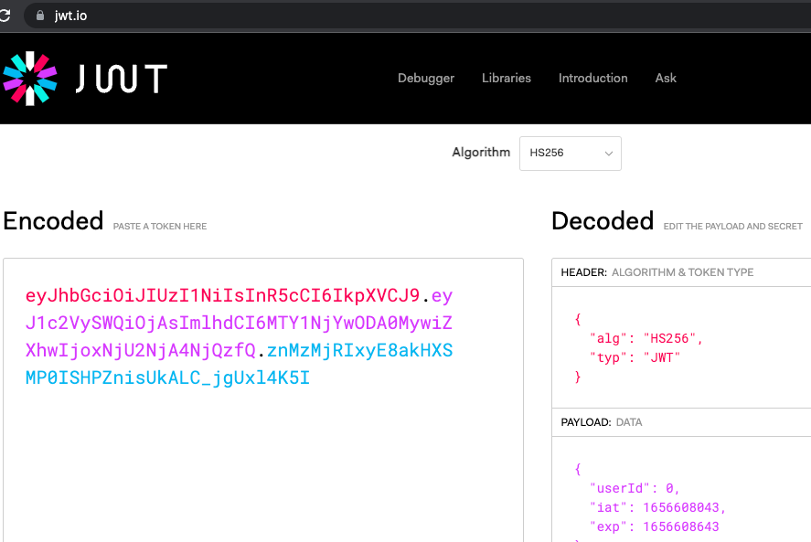
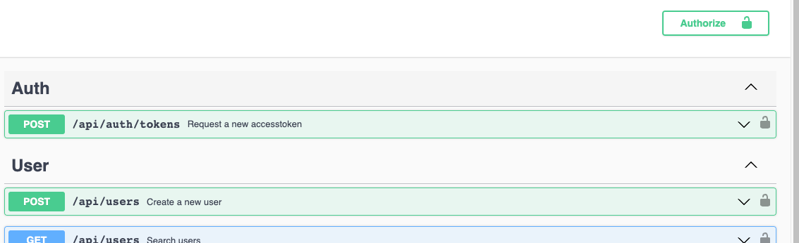
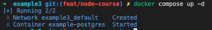
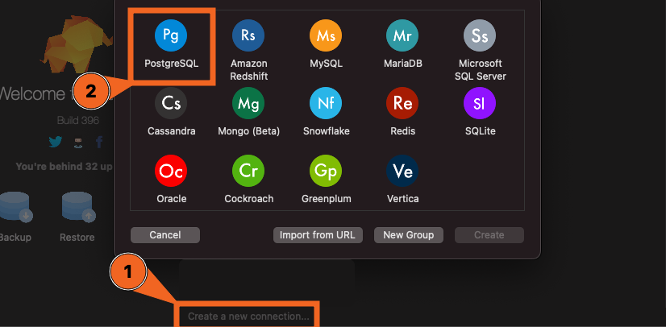
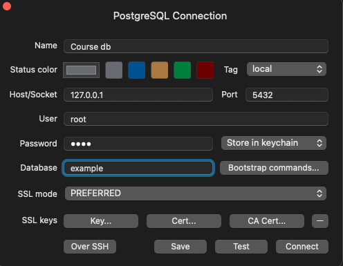
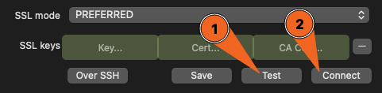

# Module 3

The previous modules showed you the main features of express. Now it's time to
go to a whole other level and create a real world setup.

The next part will consist of a few large topics:

-   Papi & routing-controllers for easy controller definition and contract
    validation/representation
-   Swagger for automatically generated API documentation
-   Authentication and authorization for access management
-   Databases for storing data

# papi & routing-controllers

[@panenco/papi](https://www.npmjs.com/package/@panenco/papi) is package we
developed in house to provide reusable utilities across products.

The package is documented in
it's [README](https://github.com/Panenco/papi/blob/main/README.md)

## Development Philosophy

Papi is a small superset on top
of [class validator](https://www.npmjs.com/package/class-validator), [class transformer](https://www.npmjs.com/package/class-transformer)
and [routing-controllers](https://www.npmjs.com/package/routing-controllers) that
forces our opinionated way of working. It highly depends on decorators to define
endpoints and contracts.

The default flow of a feature/endpoint always has 4 steps:

1. Authorize the user
    - Validate the token
    - Validate the access rights to the resource
2. Validate the input
    - Transform and strip the input
      with [class transformer](https://www.npmjs.com/package/class-transformer).
      Make sure no unknown properties can be provided, parse all items to the
      correct type (ex. string to date)
    - Validate the input
      with [class validator](https://www.npmjs.com/package/class-validator)
      trough our Body or Query decorators
3. Execute the business logic
    - The endpoint lands in the controller, the controller should contain
      absolutely no logic and should instantly call the handler
    - The handler contains all logic but can call several helpers, clients or
      services
4. Representation
    - Transform the output of the handler to a predefined view contract

By following these few steps it will be easy to build clean, secure and
maintainable API's.

## Add packages

There are 2 packages we still need to
add [@panenco/papi](https://www.npmjs.com/package/@panenco/papi)
and [routing-controllers](https://www.npmjs.com/package/routing-controllers)
because previously we already added `class-transformer` and `class-validator`.

```bash
pnpm add routing-controllers@0.10.4 @panenco/papi cors
```

Some warnings will be shown but they can be ignored as we are not impacted by
them.

## Bootstrap in app.ts

The initialization of routes works a little bit different
with `routing-controllers` than plain `express`.

Let's immediately clean up the code a bit and add a private
method `initializeControllers` in the `App` class that takes as an argument a
list of controllers (currently just [`UserRoute`]).

```
private initializeControllers(controllers: Function[]) {
   useExpressServer(this.host, { // Link the express host to routing-controllers
   cors: {
      origin: "*", // Allow all origins, any application on any url can call our api. This is why we also added the `cors` package.
      exposedHeaders: ["x-auth"], // Allow the header `x-auth` to be exposed to the client. This is needed for the authentication to work later.
   },
   controllers, // Provide the controllers. Currently this won't work yet, first we need to convert the Route to a routing-controllers controller.
   defaultErrorHandler: false, // Disable the default error handler. We will handle errors through papi later.
   routePrefix: "/api", // Map all routes to the `/api` path.
   });
}
```

Now you can replace the `UserRoute` initialization with a call
to `initializeControllers` and pass the constructor of the route.

```ts
this.initializeControllers([UserRoute]);
```

In addition, you can also automatically detect all controllers by making use of
papi's `importClasses` function. If you'd like to do so you can find some
info [here](https://github.com/Panenco/papi/blob/main/docs/modules.md#importclasses).

## Convert users route to controller

### Controller definition

In `routing-controllers` what makes a controller a controller is simply
the `JsonController` decorator. Because the class is decorated with this
decorator `routing-controllers` will understand how to process the class.

You need to specify the route path in the decorator, in our case this should
be `/users`.

Your result should look like this:

```ts
@JsonController("/users")
export class UserRoute {}
```

However, the name is actually not valid anymore.
The Route is no longer a router but a controller.  
Rename the class to `UserController`.
Make use of the VSCode built in refactoring to rename the class by
pressing [`f2`] (or [`fn`]+[`f2`] depending
on your settings). By changing the name like this all references will
automatically be renamed as well.  
Now also rename the file `user.controller.ts`

### Add all endpoints to the controller

Endpoints are defined completely different from what we had before. Instead of
constructing the endpoint with express router, we now can simply add a method
for
each endpoint with some decorators.

Very detailed examples and documentation can be found
on [their github](https://github.com/typestack/routing-controllers).

Converting the code:

1. Remove the router and the path properties from the controller
2. Comment the entire constructor for now
3. Add a method for each endpoint

    The controller should look like this now:

    ```ts
    @JsonController("/users")
    export class UserController {
    	//   constructor() {
    	//     this.router = Router();
    	//     this.path = "users";

    	//     this.router.post("/", adminMiddleware, create);
    	//     this.router.get("/", getList);
    	//     this.router.get("/:id", get);
    	//     this.router.patch(
    	//       "/:id",
    	//       patchValidationMiddleware,
    	//       update,
    	//       representationMiddleware
    	//     );
    	//     this.router.delete("/:id", deleteUser);
    	//   }
    	async create() {}

    	async getList() {}

    	async get() {}

    	async update() {}

    	async delete() {}
    }
    ```

4. Next up you should tell `routing-controllers` that these methods are the
   routes, specify the path and the http-method.

    `routing-controllers` has some decorators to accomplish this. For each
    http-method there is a decorator, the argument you pass defines the path.
    ex `@Post("/users")`

    When that's done `routing-controllers` will actually know the endpoints we
    have defined.

5. In the method body you can call the handlers now. Currently, that will still
   give errors as we don't pass the arguments defined in the handlers yet. We'll
   be fixing that later.

    Most of the commented code is now converted so lets clean it up. Remove all
    lines except the `post` and `patch`; we'll come back to the middleware used
    there later.

The current code:

```ts
@JsonController("/users")
export class UserController {
	//     this.router.post("/", adminMiddleware, create);
	//     this.router.patch(
	//       "/:id",
	//       patchValidationMiddleware,
	//       update,
	//       representationMiddleware
	//     );
	@Post()
	async create() {
		return create();
	}

	@Get()
	async getList() {
		return getList();
	}

	@Get("/:id")
	async get() {
		return get();
	}

	@Patch("/:id")
	async update() {
		return update();
	}

	@Delete("/:id")
	async delete() {
		await deleteUser();
	}
}
```

#### papi body decorator to inject body

Previously we implemented body validation manually in the handler, after that we
converted it into middleware.  
Now we will be using papi's `body` decorator to inject the body into the
controller method and have the body automatically transformed and validated.

The decorator should be used just before an argument, for example:

```
async create(@Body() body: UserBody) {}
```

The type of `UserBody` will automatically be inferred and used for the
transformation and validation.

> Note: `routing-controllers` also has a `@Body` decorator. Make sure you import
> the one from `@panenco/papi` and **not** the one from `routing-controllers`.
> The handler arguments will be changed later in this section.

For updating an entity we don't want to require all properties to be provided,
to skip these we can set some options in the decorator:

```
async update(@Body({}, {skipMissingProperties: true}) body: UserBody) {}
```

That covers all body validations that previously were done manually. You can
remove `patchValidationMiddleware` and the manual validation/transformation from
the `create` handler now.

#### papi query decorator to inject search param

The query decorator actually works exactly the same as the body decorator, only
instead of processing `request.body` it processes `request.query`.

For the get list endpoint we expect a search parameter. In order to validate the
parameter you can add a query contract: `src/contracts/search.query.ts` where
you validate it as a string and specify it as optional.

Defining the contract:

```ts
// search.query.ts
@Exclude()
export class SearchQuery {
	@Expose()
	@IsString()
	@IsOptional()
	public search?: string;
}
```

And use it like this:

```
async getList(@Query() query: SearchQuery) {}
```

#### routing-controllers Param decorator to inject id's (or other params)

`request.params` needs to be injected one by one with the `@Param` decorator
from `routing-controllers`. Type conversion is not supported here so it will
always inject a string.

It's used like this:

```
async get(@Param("id") id: string){}
```

Apply this decorator to all endpoints containing an id.

#### Middleware decorators

The last thing we need from the currently commented route definitions is
the `adminMiddleware`.

To allow middleware to be registered on endpoints, `routing-controllers` has
the `@UseBefore` and `@UseAfter` decorators.

The `@UseBefore` decorator is used to register middleware before the endpoint is
called.
The `@UseAfter` decorator is used to register middleware after the endpoint is
called.

We want the `adminMiddleware` to be called before the handler is hit so we
use `@UseBefore`:

```
@Post()
@UseBefore(adminMiddleware)
async create(@Body() body: UserBody) {
	return create(body);
}
```

The view/representation middleware we'll cover in a bit.

So you can go ahead and remove the remaining commented
code, `patchValidationMiddleware` and `representationMiddleware`.

### Converting handlers

With plain express we had to manually take what we needed from the request.
Quite a hassle to do. Definitely when trying to test a handler and you need to
mock the request/response.

Since we are injecting only the items we need now, this becomes a lot easier.

1. Replace the arguments in each handler with the ones we
   need: `body`, `id`, `query`
    - Also pass the these arguments to the handler from the controller
2. Return the result instead of calling `res.json(...)` or assigning it
   to `locals`
3. Remove the validation/transformation as this has now been abstracted away
   with the decorators
4. Remove the `next` function calls
5. Throw a papi `NotFound` error when no user is found instead of manually
   returning an error (we'll come back to this in the next section)

Now all references to `request`, `response` and `next` are gone. The build
errors in the handlers and controller should also be resolved.

<details>
<summary>user.controller.ts</summary>

```ts
import { Body, Query } from "@panenco/papi";
import { NextFunction, Request, Response } from "express";
import {
	Delete,
	Get,
	JsonController,
	Param,
	Patch,
	Post,
	UseBefore,
} from "routing-controllers";

import { SearchQuery } from "../../contracts/search.query";
import { UserBody } from "../../contracts/user.body";
import { create } from "./handlers/create.handler";
import { deleteUser } from "./handlers/delete.handler";
import { get } from "./handlers/get.handler";
import { getList } from "./handlers/getList.handler";
import { update } from "./handlers/update.handler";

const adminMiddleware = (req: Request, res: Response, next: NextFunction) => {
	if (req.header("x-auth") !== "api-key") {
		return res.status(401).send("Unauthorized");
	}
	next();
};

@JsonController("/users")
export class UserController {
	@Post()
	@UseBefore(adminMiddleware)
	async create(@Body() body: UserBody) {
		return create(body);
	}

	@Get()
	async getList(@Query() query: SearchQuery) {
		return getList(query.search);
	}

	@Get("/:id")
	async get(@Param("id") id: string) {
		return get(id);
	}

	@Patch("/:id")
	async update(
		@Param("id") id: string,
		@Body({}, { skipMissingProperties: true }) body: UserBody
	) {
		return update(id, body);
	}

	@Delete("/:id")
	async delete(@Param("id") id: string) {
		deleteUser(id);
		return null;
	}
}
```

</details>

<details>
<summary>create.handler.ts</summary>

```ts
import { RequestContext } from "@mikro-orm/core";

import { UserBody } from "../../../contracts/user.body";
import { User } from "../../../entities/user.entity";

export const create = async (body: UserBody) => {
	const em = RequestContext.getEntityManager();
	const user = em.create(User, body);
	await em.persistAndFlush(user);
	return user;
};
```

</details>

<details>
<summary>getList.handler.ts</summary>

```ts
import { RequestContext } from "@mikro-orm/core";

import { User } from "../../../entities/user.entity";

export const getList = async (search?: string) => {
	const em = RequestContext.getEntityManager();
	const users = await em.find(
		User,
		search ? { name: { $like: `%${search}%` } } : {}
	);
	return users;
};
```

</details>

<details>
<summary>get.handler.ts</summary>

```ts
import { RequestContext } from "@mikro-orm/core";
import { NotFound } from "@panenco/papi";

import { User } from "../../../entities/user.entity";

export const get = async (id: string) => {
	const em = RequestContext.getEntityManager();
	const user = await em.findOne(User, { id });
	if (!user) {
		throw new NotFound("userNotFound", "User not found");
	}
	return user;
};
```

</details>

<details>
<summary>update.handler.ts</summary>

```ts
import { RequestContext } from "@mikro-orm/core";
import { NotFound } from "@panenco/papi";

import { UserBody } from "../../../contracts/user.body";
import { User } from "../../../entities/user.entity";

export const update = async (id: string, body: Partial<UserBody>) => {
	const em = RequestContext.getEntityManager();
	const user = await em.findOne(User, { id });
	if (!user) {
		throw new NotFound("userNotFound", "User not found");
	}
	em.assign(user, body);
	await em.persistAndFlush(user);
	return user;
};
```

</details>

<details>
<summary>delete.handler.ts</summary>

```ts
import { RequestContext } from "@mikro-orm/core";
import { NotFound } from "@panenco/papi";

import { User } from "../../../entities/user.entity";

export const deleteUser = async (id: string) => {
	const em = RequestContext.getEntityManager();
	const user = await em.findOne(User, { id });
	if (!user) {
		throw new NotFound("userNotFound", "User not found");
	}
	await em.removeAndFlush(user);
};
```

</details>
<br>

### Papi Error handling

Handling expected errors manually is a bit of a pain as you might have noticed
when doing so in a previous section. It's much easier to just be able to throw
a `papi` error and have it handled in the background.

You already implemented the `NotFound` error but there are
other [errors](https://github.com/Panenco/papi/blob/main/docs/modules.md#error-classes)
as well.

There are 2 things you need to do to set it up:

-   Use the papi `errorMiddleware`
-   Allow for async errors

#### Papi error middleware

Papi comes
with [errorMiddleware](https://github.com/Panenco/papi/blob/main/docs/modules.md#errormiddleware)
to handle papi errors, this way errors are consistently parsed and handled.

Simply replace the custom error middleware in `app.ts` with the one from
papi.

```ts
this.host.use(errorMiddleware);
```

#### Async errors

Throwing errors in an asynchronous context is a bit of a pain, luckily there is
a package that takes care of
this: [express-async-errors](https://www.npmjs.com/package/express-async-errors).
It's basically a hack that changes some small things in the inner workings of
express.

In express v5 this will no longer be needed, but for now let's add it.

Add the package:

```bash
pnpm add express-async-errors
```

Now it only needs to be imported once before anything else loads. So put it at
the top of `app.ts`:

```ts
import "express-async-errors";
```

## Representer decorators

By now I think you see the value of the decorators and how it can make life
easier by abstracting recurring code away.

Much like the Body/Query decorators there are also decorators to represent the
response:

-   [Representer](https://github.com/Panenco/papi/blob/main/docs/modules.md#representer)
-   [ListRepresenter](https://github.com/Panenco/papi/blob/main/docs/modules.md#listrepresenter)
-   [ArrayRepresenter](https://github.com/Panenco/papi/blob/main/docs/modules.md#arrayrepresenter)

These decorators ensure your output is correctly serialized and strip out all
data not represented in the view.

2 arguments can be passed to the decorators:

-   View: The view contract you want to be serialized, `null` if no response is
    needed (Mandatory)
-   Status code: The status code you want to return (Optional)
    -   Want to learn more
        about [status codes](https://developer.mozilla.org/en-US/docs/Web/HTTP/Status)?

### Use the Representer

Apply the `@Representer` decorator with the `UserView` on all endpoints except
the get list endpoint.

<details>
<summary>The code</summary>

```
@Post()
@UseBefore(adminMiddleware)
@Representer(UserView, StatusCode.created)
async create(@Body() body: UserBody) {
	return create(body);
}

@Get("/:id")
@Representer(UserView)
async get(@Param("id") id: string) {
	return get(id);
}

@Patch("/:id")
@Representer(UserView)
async update(@Param("id")id: string, @Body({}, {skipMissingProperties: true}) body: UserBody) {
	return update(id, body);
}

@Delete("/:id")
@Representer(null)
async delete (@Param("id") id: string) {
	deleteUser(id);
}
```

</details>

### Use the ListRepresenter

In real world applications, arrays should always
be [paginated](https://stackoverflow.com/questions/12168624/pagination-response-payload-from-a-restful-api).
That means only a certain amount of items should be returned. To get the next
page some extra input is needed. `offset` and `limit` for instance.  
However in our small example it makes no sense to fully implement pagination but
let's cover the representation part of it already.

When returning a paginated list we should also output the **total amount** of
items. This way the client can show the amount of pages there are in total. For
our example we will be returning the entire list at all times, so we can just
return the length of the list.

The `ListRepresenter` will return something like this to the client:

```json
{
	"items": [],
	"count": 0
}
```

This would be the result of a return statement like this: `return [[], 0]`

Apply the `@ListRepresenter` decorator with the `UserView` on the get list
endpoint.

In order to keep things simple modify the handler to return a fake paginated
list of users:

-   `return [users, users.length];`
-   Explicitly set the return type to `[UserView[], number]`

Putting it all together:

```ts
export const getList = (search: string): [User[], number] => {
	const users = UserStore.find(search);
	return [users, users.length];
};
```

<details>
<summary>The code</summary>

```
@Get()
@Authorized()
@ListRepresenter(UserView)
@OpenAPI({summary: 'Search users'})
async getList(@Query() query: SearchQuery) {
	return getList(query.search);
}

```

</details>

## Fix tests

While converting the code, we introduced some breaking changes. That means the
previously created tests will no longer work.  
The handlers now have different arguments and responses, so we need to adjust the
tests accordingly.  
Most endpoints themselves are exactly the same, so the integration tests should
remain mainly the same.  
However, there are some small changes like the view that was not applied on all
endpoints or the list response that is introduced now.

### Handler tests without the request/response

The handlers have a simple, readable signature now, without the bloated express
objects.
So now you can simplify the tests and remove the mocked request and response.
Just pass in the arguments you need and get the return value to validate.

<details>
<summary>The code</summary>

```ts
import { expect } from "chai";
import { beforeEach, describe, it } from "mocha";

import { create } from "../../controllers/users/handlers/create.handler";
import { deleteUser } from "../../controllers/users/handlers/delete.handler";
import { get } from "../../controllers/users/handlers/get.handler";
import { getList } from "../../controllers/users/handlers/getList.handler";
import { update } from "../../controllers/users/handlers/update.handler";
import { User, UserStore } from "../../controllers/users/handlers/user.store";

const userFixtures: User[] = [
	{
		name: "test1",
		email: "test-user+1@panenco.com",
		id: 0,
		password: "password1",
	},
	{
		name: "test2",
		email: "test-user+2@panenco.com",
		id: 1,
		password: "password2",
	},
];

describe("Handler tests", () => {
	describe("User Tests", () => {
		beforeEach(() => {
			UserStore.users = [...userFixtures]; // Clone the array
		});

		it("should get users", () => {
			const [res, total] = getList(null);

			expect(res.some((x) => x.name === "test2")).true;
		});

		it("should get user by id", () => {
			const res = get("1");

			expect(res.name).equal("test2");
			expect(res.email).equal("test-user+2@panenco.com");
		});

		it("should fail when getting user by unknown id", () => {
			try {
				get("999");
			} catch (error) {
				expect(error.message).equal("User not found");
				return;
			}
			expect(true, "should have thrown an error").false;
		});

		it("should create user", async () => {
			const body = {
				email: "test-user+new@panenco.com",
				name: "newUser",
				password: "reallysecretstuff",
			} as User;
			const res = await create(body);

			expect(res.name).equal("newUser");
			expect(res.email).equal("test-user+new@panenco.com");
		});

		it("should update user", async () => {
			const body = {
				email: "test-user+updated@panenco.com",
			} as User;
			const id = 0;
			const res = update(id.toString(), body);

			expect(res.email).equal(body.email);
			expect(res.name).equal("test1");
			expect(UserStore.users.find((x) => x.id === id).email).equal(
				body.email
			);
		});

		it("should delete user by id", () => {
			const initialCount = UserStore.users.length;
			deleteUser("1");

			expect(UserStore.users.some((x) => x.id === 1)).false;
			expect(initialCount - 1).equal(UserStore.users.length);
		});
	});
});
```

</details>

### Fix integration tests

The integration test shouldn't have any build error at this point. So to know if
anything needs to change here we can simply run them.

For me there were a few changes needed:

-   Provide a body when validating the access (unauthorized) on the create
    endpoint. (this happens because the Body is validated before the UseBefore
    middleware. Not really a problem, but it's not ideal.)
-   Process the list response a bit different as now we have the `items` + `count`

> Bonus: Papi has named status codes in the `StatusCode` enum. So you can use
> them instead of specifying numbers to validate the status code.

<details>
<summary>The code</summary>

```ts
import { StatusCode } from "@panenco/papi";
import { expect } from "chai";
import { beforeEach, describe, it } from "mocha";
import supertest from "supertest";

import { App } from "../../app";
import { UserBody } from "../../contracts/user.body";
import { User, UserStore } from "../../controllers/users/handlers/user.store";

describe("Integration tests", () => {
	describe("User Tests", () => {
		let request: supertest.SuperTest<supertest.Test>;
		beforeEach(() => {
			UserStore.users = [];
			const app = new App();

			request = supertest(app.host);
		});

		it("should CRUD users", async () => {
			// Unauthorized without "api-key"
			await request
				.post(`/api/users`)
				.send({
					email: "test@test.test",
					name: "test",
					password: "testtestest",
				} as UserBody)
				.expect(StatusCode.unauthorized);

			// Successfully create new user
			const { body: createResponse } = await request
				.post(`/api/users`)
				.send({
					name: "test",
					email: "test-user+1@panenco.com",
					password: "real secret stuff",
				} as User)
				.set("x-auth", "api-key")
				.expect(StatusCode.created);

			expect(
				UserStore.users.some((x) => x.email === createResponse.email)
			).true;

			// Get the newly created user
			const { body: getResponse } = await request
				.get(`/api/users/${createResponse.id}`)
				.expect(StatusCode.ok);
			expect(getResponse.name).equal("test");

			// Get all users
			const { body: getListRes } = await request
				.get(`/api/users`)
				.expect(StatusCode.ok);
			const { items, count } = getListRes;
			expect(items.length).equal(1);
			expect(count).equal(1);

			// Successfully update user
			const { body: updateResponse } = await request
				.patch(`/api/users/${createResponse.id}`)
				.send({
					email: "test-user+1@panenco.com",
				} as User)
				.expect(StatusCode.ok);

			expect(updateResponse.name).equal("test");
			expect(updateResponse.email).equal("test-user+1@panenco.com");
			expect(updateResponse.password).undefined; // middleware transformed the object to not include the password

			// Delete the newly created user
			await request.delete(`/api/users/${createResponse.id}`).expect(204);

			// Get all users again after deleted the only user
			const { body: getNoneResponse } = await request
				.get(`/api/users`)
				.expect(StatusCode.ok);
			const { count: getNoneCount } = getNoneResponse;
			expect(getNoneCount).equal(0);
		});
	});
});
```

</details>

🥳 🚀 That's all for the papi conversion of the API. Next up... **Authentication**

# Authentication & Authorization

Currently most of our endpoints are publicly available or with a very bad
authorization technique (e.g. `api-key`).  
Luckily `papi` and `routing-controllers` provide a few utilities to easily
implement this.

We'll not go into a lot of detail on the basic principles here, but the Udemy
course has a quite extensive explanation on this
topic: [Section 12: API Authentication and Security (Task App)](https://www.udemy.com/course/the-complete-nodejs-developer-course-2/learn/lecture/13729276#overview)

## The basics

A brief intro:

-   Authentication: Verify a user's identity by checking their credentials. In our
    case we will always return a [`JWT token`](https://jwt.io)
    -   When a user provides invalid credentials, we should return
        a `401 Unauthorized` error.
-   Authorization: Use the JWT token to verify whether the user has access to the
    requested resource.
    -   When the token itself is invalid, we should return a `401 Unauthorized`
        error.
    -   When the token is valid but the user has no access to the resource we
        should return a `403 Forbidden` error.

The `@Authorized` decorator should be used to mark the endpoint as requiring a
token.  
You can pass
in [requirements](https://github.com/Panenco/papi/blob/main/docs/modules.md#irequirement)
to add custom validations like `isAdmin`, `belongsToOrganization`, etc. But we
won't be covering requirements.

Have a look at
the [papi authorization docs](https://github.com/Panenco/papi/blob/main/README.md#authorization)
for more info.

## Login

You can make authenticating users quite complex but to get you started we'll be
implementing the most basic and unsecure login ever.

The login endpoint should exist in a new controller, the `AuthController`.

1. Create the controller (in a new `auth` folder)
2. Add the new exported class `AuthController` with the `JsonController`
   decorator and register it in the `App` class.
3. Create a new `LoginBody` contract that contains password and email
4. Create a new `AccessTokenView` contract that contains token and expiresIn
5. Add a handler in `src/controllers/auth/handlers/login.handler.ts` that will
   handle the login request.
    1. As input you have the `LoginBody` contract
    2. As output you have the `AccessTokenView` contract
    3. Use `getByEmail` from the `UserStore` to find the user
    4. Validate the user's password
        1. Simply compare both passwords in plain text. (this is a bad idea,
           it's just an example)
        2. Either if the user is not found or the password is wrong, throw
           an `Unauthorized` error
    5. Use
       the [`createAccessToken`](https://github.com/Panenco/papi/blob/main/docs/modules.md#createaccesstoken)
       helper from papi to create a JWT token
        1. This is an `async` function so you need to `await` it
        2. secret: used to verify the fact that our application created the
           token by the `@Authorize` decorator
        3. expiresIn: amount of seconds the token should be valid (put it to 10
           minutes)
        4. data: you can put basically anything in there. In our case we'll just
           put the user id
        5. return the result
6. Create the endpoint in the controller with the `LoginBody`, `AccessTokenView`
   and call the handler

When testing this you can check the contents of the JWT token
on [jwt.io](jwt.io)  


<details>
<summary>login.body.ts</summary>

```ts
import { Exclude, Expose } from "class-transformer";
import { IsEmail, IsString } from "class-validator";

@Exclude()
export class LoginBody {
	@Expose()
	@IsEmail()
	public email: string;

	@Expose()
	@IsString()
	public password: string;
}
```

</details>

<details>
<summary>accessToken.view.ts</summary>

```ts
import { Exclude, Expose } from "class-transformer";
import { IsNumber, IsString } from "class-validator";

@Exclude()
export class AccessTokenView {
	@Expose()
	@IsString()
	public token: string;

	@Expose()
	@IsNumber()
	public expiresIn: number;
}
```

</details>

<details>
<summary>auth.controller.ts</summary>

```ts
import { Representer } from "@panenco/papi";
import { Body, JsonController, Post } from "routing-controllers";

import { AccessTokenView } from "../../contracts/accessToken.view";
import { LoginBody } from "../../contracts/login.body";
import { login } from "./handlers/login.handler";

@JsonController("/auth")
export class AuthController {
	@Post("/tokens")
	@Representer(AccessTokenView)
	async create(@Body() body: LoginBody) {
		return login(body);
	}
}
```

</details>

<details>
<summary>login.handler.ts</summary>

```ts
import { createAccessToken, Unauthorized } from "@panenco/papi";

import { LoginBody } from "../../../contracts/login.body";
import { UserStore } from "../../users/handlers/user.store";

export const login = async (body: LoginBody) => {
	const user = UserStore.getByEmail(body.email);
	if (!user || user.password !== body.password) {
		throw new Unauthorized("unauthorized", "Invalid credentials");
	}
	const result = await createAccessToken("jwtSecretFromConfigHere", 60 * 10, {
		userId: user.id,
	}); // Important this secret is also used for the authenticator initialization in app.ts
	return result;
};
```

</details>

## Authenticator

The authenticator is the thing that will verify the JWT token and execute the
requirements.

In order for the papi authenticator to be used, you need to initialize it when
setting up `routing-controllers` in `App`.

The final code should look like the sample below:

```
private initializeControllers(controllers: Function[]) {
	useExpressServer(this.host, {
		cors: {
			origin: '*',
			exposedHeaders: ['x-auth'],
		},
		controllers,
		defaultErrorHandler: false,
		routePrefix: '/api',
		authorizationChecker: getAuthenticator('jwtSecretFromConfigHere'), // Tell routing-controllers to use the papi authentication checker
	});
}
```

Now when we use the `@Authorized` decorator, the `papi` authenticator will be
used, with your secret to validate the tokens created by the login handler.

## @Authorized()

All preparations have been done, and it's finally time to secure our endpoints!

Simply add the `@Authorized` decorator to your users endpoints and the endpoints
will no longer be freely available. Secure get, getList, patch and delete. Leave
the `POST` endpoint publicly available so you can still create new users.

When running your integration test now you'll notice it's failing with
a `Unauthorized` errors. Change it up a bit to first create a new user, then
login and use the response token in the `x-auth` header to access the other
endpoints.

Meanwhile we also have no use for the `adminMiddleware` anymore so you can
completely remove it.

<details>
<summary>user.controller.ts</summary>

```ts
import {
	Body,
	ListRepresenter,
	Query,
	Representer,
	StatusCode,
} from "@panenco/papi";
import {
	Authorized,
	Delete,
	Get,
	JsonController,
	Param,
	Patch,
	Post,
} from "routing-controllers";

import { SearchQuery } from "../../contracts/search.query";
import { UserBody } from "../../contracts/user.body";
import { UserView } from "../../contracts/user.view";
import { create } from "./handlers/create.handler";
import { deleteUser } from "./handlers/delete.handler";
import { get } from "./handlers/get.handler";
import { getList } from "./handlers/getList.handler";
import { update } from "./handlers/update.handler";

@JsonController("/users")
export class UserController {
	@Post()
	@Representer(UserView, StatusCode.created)
	async create(@Body() body: UserBody) {
		return create(body);
	}

	@Get()
	@Authorized()
	@ListRepresenter(UserView)
	async getList(@Query() query: SearchQuery) {
		return getList(query.search);
	}

	@Get("/:id")
	@Authorized()
	@Representer(UserView)
	async get(@Param("id") id: string) {
		return get(id);
	}

	@Patch("/:id")
	@Authorized()
	@Representer(UserView)
	async update(
		@Param("id") id: string,
		@Body({}, { skipMissingProperties: true }) body: UserBody
	) {
		return update(id, body);
	}

	@Delete("/:id")
	@Authorized()
	@Representer(null)
	async delete(@Param("id") id: string) {
		deleteUser(id);
	}
}
```

</details>

<details>
<summary>user.integration.test.ts</summary>

```ts
import { StatusCode } from "@panenco/papi";
import { expect } from "chai";
import { beforeEach, describe, it } from "mocha";
import supertest from "supertest";

import { App } from "../../app";
import { User, UserStore } from "../../controllers/users/handlers/user.store";

describe("Integration tests", () => {
	describe("User Tests", () => {
		let request: supertest.SuperTest<supertest.Test>;
		beforeEach(async () => {
			UserStore.users = [];
			const app = new App();

			request = supertest(app.host);
		});

		it("should CRUD users", async () => {
			// Unauthorized without "token"
			await request.get(`/api/users`).expect(StatusCode.unauthorized);

			// Successfully create new user
			const { body: createResponse } = await request
				.post(`/api/users`)
				.send({
					name: "test",
					email: "test-user+1@panenco.com",
					password: "real secret stuff",
				} as User)
				.expect(StatusCode.created);

			// Login
			const { body: loginResponse } = await request
				.post(`/api/auth/tokens`)
				.send({
					email: "test-user+1@panenco.com",
					password: "real secret stuff",
				} as User)
				.expect(StatusCode.ok);
			const token = loginResponse.token;

			expect(
				UserStore.users.some((x) => x.email === createResponse.email)
			).true;

			// Get the newly created user
			const { body: getResponse } = await request
				.get(`/api/users/${createResponse.id}`)
				.set("x-auth", token)
				.expect(StatusCode.ok);
			expect(getResponse.name).equal("test");

			// Get all users
			const { body: getListRes } = await request
				.get(`/api/users`)
				.set("x-auth", token)
				.expect(StatusCode.ok);
			const { items, count } = getListRes;
			expect(items.length).equal(1);
			expect(count).equal(1);

			// Successfully update user
			const { body: updateResponse } = await request
				.patch(`/api/users/${createResponse.id}`)
				.send({
					email: "test-user+1@panenco.com",
				} as User)
				.set("x-auth", token)
				.expect(StatusCode.ok);

			expect(updateResponse.name).equal("test");
			expect(updateResponse.email).equal("test-user+1@panenco.com");
			expect(updateResponse.password).undefined; // middleware transformed the object to not include the password

			// Get the newly created user
			await request
				.delete(`/api/users/${createResponse.id}`)
				.set("x-auth", token)
				.expect(204);

			// Get all users again after deleted the only user
			const { body: getNoneResponse } = await request
				.get(`/api/users`)
				.set("x-auth", token)
				.expect(StatusCode.ok);
			const { count: getNoneCount } = getNoneResponse;
			expect(getNoneCount).equal(0);
		});
	});
});
```

</details>

# API Documentation

Manually writing and maintaining API documentation is a horrible task to do.
Some things will always be incorrect or not up to date. Frontend developers will
have a terrible experience as they don't have a correct guide on what endpoints
there are and what they do.

Luckily it's amazingly easy to generate these docs automatically because of the
decorator based approach we're using.

2 things to understand:

-   [OpenAPI](https://swagger.io/specification/): A specification for how to
    describe an API. It's the standardized format we need to serve into a
    graphical interface of our endpoints. It will contain all information about
    the contracts and endpoints.
-   [Swagger](https://swagger.io/solutions/api-documentation/): The actual
    interface we use to display the documentation.

## Configure swagger

### Add packages

```bash
pnpm add class-validator-jsonschema@5.0.0 routing-controllers-openapi@4.0.0 swagger-ui-express@4.4.0
```

-   `class-validator-jsonschema` to convert all the data from the decorators (
    metadata) to an OpenAPI json schema
-   `swagger-ui-express` to display the documentation
-   `routing-controllers-openapi` to hook up `routing-controllers` with swagger

add module overrides in package.json to fix a dependency issue with routing controllers

```json
{
	"pnpm": {
		"overrides": {
			"openapi3-ts": "3.2.0"
		}
	}
}
```

and run `pnpm install`.

### Configure swagger-ui in app.ts

Add a private method in app.ts to configure swagger and call it after the
controllers are initialized.

Some explanation is inline:

```ts
import { getMetadataStorage } from "class-validator";

class App {
	// ...
	private initializeSwagger() {
		const schemas = validationMetadatasToSchemas({
			classValidatorMetadataStorage: getMetadataStorage(),
			refPointerPrefix: "#/components/schemas/",
		});

		const routingControllersOptions: RoutingControllersOptions = {
			routePrefix: "/api",
		};

		const storage = getMetadataArgsStorage();
		const spec = routingControllersToSpec(
			storage,
			routingControllersOptions,
			{
				components: {
					schemas,
					securitySchemes: {
						JWT: {
							in: "header",
							name: "x-auth",
							type: "apiKey",
							bearerFormat: "JWT",
							description:
								'JWT Authorization header using the JWT scheme. Example: "x-auth: {token}"',
						},
					},
				},
				security: [{ JWT: [] }],
			}
		);

		this.host.use("/docs", swaggerUi.serve, swaggerUi.setup(spec));
	}
}
```

### Endpoint descriptions

This will already give you very handy docs. However if you have 100+ endpoints,
not every endpoint might be very self explanatory.  
To fix that we can add some descriptions. To do so you can add the `OpenAPI`
decorator to your endpoint and provide some summary.

Like this:

```
@Post()
@Representer(UserView, StatusCode.created)
@OpenAPI({summary: 'Create a new user'})
async create(@Body() body: UserBody) {
	return create(body);
}
```

## Test out swagger

You can go ahead and start up your API and checkout the docs
on [localhost:3000/docs](http://localhost:3000/docs).  


For instance, execute a flow in there:

-   Create a user
-   Get login
-   Configure it in the top right with the "Authorize" button
-   Get your user

In the end the `app.ts` should look like this:

<details>
<summary>app.ts</summary>

```ts
import "express-async-errors";
import { errorMiddleware, getAuthenticator } from "@panenco/papi";
import express, { Application } from "express";
import {
	getMetadataArgsStorage,
	RoutingControllersOptions,
	useExpressServer,
} from "routing-controllers";
import { validationMetadatasToSchemas } from "class-validator-jsonschema";
import { routingControllersToSpec } from "routing-controllers-openapi";
import swaggerUi from "swagger-ui-express";
import { getMetadataStorage } from "class-validator";
import { UserController } from "./controllers/users/user.controller";
import { AuthController } from "./controllers/auth/auth.controller";

export class App {
	host: Application;

	constructor() {
		// Init server
		this.host = express();
		this.host.use(express.json());
		this.host.use((req, res, next) => {
			// general middleware
			console.log(req.method, req.url);
			next();
		});
		this.host.get("/", (req, res, next) => {
			res.send("Hello World @ Panenco!");
		});
		const controllers = [AuthController, UserController];
		this.initializeControllers(controllers);
		this.initializeSwagger();
		this.host.use(errorMiddleware);
	}

	listen() {
		this.host.listen(3000, () => {
			console.info(`:rocket: http://localhost:3000`);
			console.info(`========================`);
		});
	}

	private initializeControllers(controllers: Function[]) {
		useExpressServer(this.host, {
			// Link the express host to routing-controllers
			cors: {
				origin: "*", // Allow all origins, any application on any url can call our api. This is why we also added the `cors` package.
				credentials: true,
				exposedHeaders: ["x-auth"], // Allow the header `x-auth` to be exposed to the client. This is needed for the authentication to work later.
			},
			controllers, // Provide the controllers. Currently this won't work yet, first we need to convert the Route to a routing-controllers controller.
			defaultErrorHandler: false, // Disable the default error handler. We will handle errors through papi later.
			routePrefix: "/api", // Map all routes to the `/api` path.
			authorizationChecker: getAuthenticator("jwtSecretFromConfigHere"), // Tell routing-controllers to use the papi authentication checker
		});
	}

	private initializeSwagger() {
		const schemas = validationMetadatasToSchemas({
			classValidatorMetadataStorage: getMetadataStorage(),
			refPointerPrefix: "#/components/schemas/",
		});

		const routingControllersOptions: RoutingControllersOptions = {
			routePrefix: "/api",
		};

		const storage = getMetadataArgsStorage();
		const spec = routingControllersToSpec(
			storage,
			routingControllersOptions,
			{
				components: {
					schemas,
					securitySchemes: {
						JWT: {
							in: "header",
							name: "x-auth",
							type: "apiKey",
							bearerFormat: "JWT",
							description:
								'JWT Authorization header using the JWT scheme. Example: "x-auth: {token}"',
						},
					},
				},
				security: [{ JWT: [] }],
			}
		);

		this.host.use("/docs", swaggerUi.serve, swaggerUi.setup(spec));
	}
}
```

</details>

# Postgres

## Intro

Up until now we've only used a minimalistic in-memory store. Obviously that's
not something you can use for a real product. So next up, it's time to use a
real database. For this example we'll be using Postgres running in a docker
container.

## Docker

Docker is a way to virtually run operating systems preinstalled with certain
software to run on your pc. No deep understanding of docker is needed for this
course but there is a ton of information online if you're interested.

### Installing docker

If it's not yet installed, you can
install [docker](https://formulae.brew.sh/formula/docker) with brew:

```bash
brew install docker
```

In order to get some extra functionality, you also need to
install [Docker Desktop](https://www.docker.com/products/docker-desktop/).

### Docker container

To configure the docker container, we'll create a compose file. This holds
information about the image to use and the variables used to configure it.

1. Add a `docker-compose.yml` file in the root of the project:

    ```yaml
    version: "3"
    services:
        postgres:
            container_name: example-postgres
            image: postgres:latest
            ports:
                - "5432:5432"
            volumes:
                - ./data/postgres:/data/example-postgres
            env_file:
                - docker.env
    ```

2. Add a `docker.env` file in the root of the project to configure postgres:

    ```env
    POSTGRES_USER=root
    POSTGRES_PASSWORD=root
    POSTGRES_DB=example
    POSTGRES_CONTAINER=example-postgres
    ```

### Running a compose file

The compose file has a default naming format so with the filename as it was
previously specified it will automatically be found.

Running a container is as simple as running `docker-compose up` in your terminal
but we want to start it in the background so we'll add `-d` flag, which gives
us:

```bash
  docker compose up -d
```



That's it, now you have a postgres database running on your pc, exposed on the
default port `5432`.

## Accessing the database

A great tool to checkout, query and update the data in a database
is [TablePlus](https://tableplus.com/).
Install it by following the instructions on their website.

When opening the app, you should see something like this:  


Adding the database:

1. Add a postgres connection  
   
2. Enter the connection details
    - Name: Course db
    - Host: 127.0.0.1
    - Port: 5432
    - User: root
    - Password: root
    - Database: example  
      
3. Test and connect
    - Hit the test button at the bottom, if no error shows up you're good to go
    - Connect  
      

Naturally, there is not a lot to see here yet because we haven't created any
tables or data yet. We'll do that next.

# MikroORM

With our CRUD routes and database in place it is now time to migrate our
handlers from using the in-memory store to functions modifying and reading our
PostgreSQL database.

To query tables in our PostgreSQL database, SQL statements are used. Instead of
writing plain SQL statements (SELECT, UPDATE, INSERT,...) in our JS handlers, we
use Object-Relational Mappers (ORMs) that do the heavy lifting for us.

An ORM provides a mapping between your database and your object oriented
programming language of choice, allowing you to query and manipulate data using
the OOP paradigms we all know and love.
For better understanding of ORMs, read
this [stack overflow explanation](https://stackoverflow.com/a/1279678).

## Intro

Each ORM comes with its own superset of functionalities and
advantages/disadvantages. While carefully following up on the newest industry
trends, we choose to use [Mikro-orm](https://mikro-orm.io/).

MikroORM is an actively maintained TypeScript ORM coming with clever performance
optimizations and many useful tools out of the box.

## Bootstrap MikroORM

### Add packages

Next to MikroORM's core package, the orm uses other packages to import language
specific functionality. Migrations are needed to easily keep our database and
code in sync, more on that later!

```bash
pnpm add @mikro-orm/core@5.7.12 @mikro-orm/postgresql@5.7.12 @mikro-orm/migrations@5.7.12 uuid @mikro-orm/cli@5.7.12
```

### Config

The ORM config file specifies items as how to connect to the database, how to
read the code, where to find certain files and how to run migrations. We discuss
migrations soon.

-   `src/orm.config.ts`

```ts
import { Options } from "@mikro-orm/core";
import { PostgreSqlDriver } from "@mikro-orm/postgresql";
import * as url from "node:url";
import path from "node:path";

import config from "./config";

const __dirname = url.fileURLToPath(new URL(".", import.meta.url));

export default {
	debug: true,
	migrations: {
		path: path.join(__dirname, "migrations"),
		tableName: "migrations",
		transactional: true,
		pattern: /^[\w-]+\d+\.(ts|js)$/,
		disableForeignKeys: false,
		emit: "ts",
	},
	type: "postgresql",
	entities: [path.join(process.cwd(), "**", "*.entity.ts")],
	user: config.postgres.user,
	password: config.postgres.password,
	dbName: config.postgres.db,
	host: config.postgres.host,
	port: config.postgres.port,
	ssl: false,
} as Options<PostgreSqlDriver>;
```

On line 6, you'll notice that a `config` parameter is imported from a `config.js` file, located in the same folder as `orm.config.ts`.
We therefore must create this config file as well:

-   `src/config.ts`

```ts
import loader from "@ljobse/appsettings-loader";
import * as fs from "node:fs";

const json = await fs.promises.readFile("./config.json", "utf8");

const config = loader.applyEnvConfig(JSON.parse(json));

// We need a default export here. Otherwise the imported object might be undefined.
export default config;
```

This config file loads a JSON and exports it so it can be loaded into `src/orm.config.ts`.
The JSON file contains the configurations that are going to be re-used across the application.
To make this work, install the loader package:

```bash
pnpm add @ljobse/appsettings-loader
```

Finally, the actual configuration is stored in the `config.json` file in the project root, so we need to create that as well.

-   `config.json`

```json
{
	"port": 3000,
	"postgres": {
		"db": "example",
		"host": "localhost",
		"password": "root",
		"port": 5432,
		"user": "root"
	}
}
```

Connecting to the database and initializing MikroORM occurs when bootstrapping
your application, right before you start listening to incoming requests.

In `server.ts` we replace the existing code with this asynchronous step and call
the function:

```ts
import { App } from "./app";

(async () => {
	const app = new App();
	await app.createConnection();
	app.listen();
})();
```

The `createConnection` method lives in `app.ts` and initializes MikroORM and
provides a database connection using the database credentials we save in a
config file:

-   `app.ts`

```ts
import { MikroORM, RequestContext } from "@mikro-orm/core";
import ormConfig from "./orm.config";

export class App {
	public orm: MikroORM<PostgreSqlDriver>;

	// ...

	public async createConnection() {
		try {
			this.orm = await MikroORM.init(ormConfig);
		} catch (error) {
			console.log("Error while connecting to the database", error);
		}
	}
}
```

> Note: Make sure not to import `MikroORM` from `@mikro-orm/core/MikroORM` but
> directly from `@mikro-orm/core`.

### Database Schema

So now our application can connect to the database, however it remains empty and
is not being used.

#### Entities

To create our database schema, MikroORM allows users to define their tables and
relations as simple javascript objects,
called [entities](https://mikro-orm.io/docs/defining-entities).

We define entities using MikroORM's _Decorated classes_ approach. The package
provides [a series of decorators](https://mikro-orm.io/docs/decorators) with a
variety of parameters, so users can customize their tables to great detail.
Declare entities with the `@Entity()` decorator, and regular properties
with `@Property()`. Other very useful decorators include the reference
decorators (`@ManyToOne()`, `@OneToOne()`...) to specify entity relations.

Try to migrate our in-memory stored user object to a full fledged MikroORM user
entity with the same properties, and check the solution afterwards.

To make the entity more realistic we'll switch the `id` property from int to a
UUID (string).

<details>
<summary>`src/entities/user.entity.ts`</summary>

```ts
import { BaseEntity, Entity, PrimaryKey, Property } from "@mikro-orm/core";
import { randomUUID } from "node:crypto";

@Entity()
export class User extends BaseEntity<User, "id"> {
	@PrimaryKey({ columnType: "uuid" })
	public id: string = randomUUID();

	@Property()
	public name: string;

	@Property({ unique: true })
	public email: string;

	@Property()
	public password: string;
}
```

</details>

There are a couple of things to note here:

-   We are using UUIDs (type string), instead of the numerical incremental ids
    from earlier.
-   We extend from MikroORM's BaseEntity to be able to access public helper
    methods (assign...) defined by the ORM. For more info, read the
    docs [here](https://mikro-orm.io/docs/entity-helper#wrappedentity-and-wrap-helper).

#### Migrations

Having defined the entity, this now needs to be translated to SQL statements to
create the accompanying database schema.

MikroORM has built-in support to generate migrations after comparing the current
database schema to the schema defined by your code entities.

Tell MikroORM where to find the config file by adding it at the end of the
package.json file:
,

```json
{
	"mikro-orm": {
		"useTsNode": true,
		"configPaths": ["./src/orm.config.ts"]
	}
}
```

To create and execute a migration:

1. Make sure your database is up and running: `docker compose up -d`
2. ts-node should already be installed from Module 2
3. Generate the migration: `pnpm mikro-orm migration:create`
4. Check the migration (`migrations/Migration<id>.cjs`) on possible errors
5. Run the pending migrations: `pnpm mikro-orm migration:up`

Now that the migration ran, a refresh of your database (`⌘+R` or `ctrl+R`) in
TablePlus should show you two tables:

-   migrations, containing the migrations executed and with a timestamp
-   user, containing the properties we defined

To find out more details about your database schema, click the 'Structure'
button in the bottom of the TablePlus app (located next to Data).

Since database migrations can run on large amounts of critical production data,
some security measures are in effect:

-   They are executed in transactions, rolling previous statements back when a
    single SQL statement fails
-   They are carefully stored and saved, allowing one to trigger a rollback in
    case something went wrong: `pnpm mikro-orm migration:down`

## Updating the handlers

With the database connected and our schema in place, we are almost ready to
update the handlers to insert, update, fetch and delete the users from the
database.

### Entity Manager and Identity Map

However, there is one more essential concept to dig into first:
MikroORM's [Entity Manager (EM)](https://mikro-orm.io/docs/entity-manager).

As part of MikroORM's performance optimizations, the EM keeps track of all
entities you have fetched from the database plus local entities you marked for
future persisting to the database. The Identity Map is used for this. When
calling the flush command, the EM calculates all pending changes and outputs
them to the database at once.

To ensure Identity Maps of different EMs don't collide, we need to fork the EM
for each request. We can use MikroORM's RequestContext for this.

-   In `app.ts`'s constructor, before initializing the controllers:

```ts
this.host.use((req, __, next: NextFunction) => {
	RequestContext.create(this.orm.em, next);
});
```

### Replacing the UserStore queries

Now we replace all occurrences of the UserStore with either a query or other
equivalent actions:

1. Get the Entity Manager from the RequestContext
2. Look up and use the EM's find, findOne, findAndCount, flush, persistAndFlush,
   deleteAndFlush methods to rewrite the handlers. (in production applications
   we don't restrict us to these EM methods)
   Some hints:
    1. The BaseEntity has helper methods for updating an entity
    2. If a search param is present when fetching a list, either the user's name
       or email has to contain this param. You'll need to use
       postgres' [ILIKE](https://www.postgresql.org/docs/current/functions-matching.html),
       which is supported by MikroORM.
3. Remove the UserStore

<details>
<summary>create.handler.ts</summary>

```ts
import { RequestContext } from "@mikro-orm/core";

import { UserBody } from "../../../contracts/user.body";
import { User } from "../../../entities/user.entity";

export const create = async (body: UserBody) => {
	const em = RequestContext.getEntityManager();
	const user = em.create(User, body);
	await em.persistAndFlush(user);

	return user;
};
```

</details>

<details>
<summary>getList.handler.ts</summary>

```ts
import { RequestContext } from "@mikro-orm/core";

import { User } from "../../../entities/user.entity";

export const getList = async (search: string) => {
	const em = RequestContext.getEntityManager();
	return em.findAndCount(
		User,
		search
			? {
					$or: [
						{ name: { $ilike: `%${search}%` } },
						{ email: { $ilike: `%${search}%` } },
					],
			  }
			: {}
	);
};
```

</details>

<details>
<summary>get.handler.ts</summary>

```ts
import { RequestContext } from "@mikro-orm/core";
import { NotFound } from "@panenco/papi";

import { User } from "../../../entities/user.entity";

export const get = async (id: string) => {
	const em = RequestContext.getEntityManager();
	const user = await em.findOne(User, { id });
	if (!user) {
		throw new NotFound("userNotFound", "User not found");
	}
	return user;
};
```

</details>

<details>
<summary>update.handler.ts</summary>

```ts
import { RequestContext } from "@mikro-orm/core";
import { NotFound } from "@panenco/papi";

import { UserBody } from "../../../contracts/user.body";
import { User } from "../../../entities/user.entity";

export const update = async (id: string, body: UserBody) => {
	const em = RequestContext.getEntityManager();
	const user = await em.findOne(User, { id });

	if (!user) {
		throw new NotFound("userNotFound", "User not found");
	}
	user.assign(body);
	await em.flush();
	return user;
};
```

</details>

<details>
<summary>delete.handler.ts</summary>

```ts
import { RequestContext } from "@mikro-orm/core";
import { NotFound } from "@panenco/papi";

import { User } from "../../../entities/user.entity";

export const deleteUser = async (id: string) => {
	const em = RequestContext.getEntityManager();
	const user = await em.findOne(User, { id });
	if (!user) {
		throw new NotFound("userNotFound", "User not found");
	}
	await em.removeAndFlush(user);
};
```

</details><details>
<summary>login.handler.ts</summary>

```ts
import { RequestContext } from "@mikro-orm/core";
import { createAccessToken, Unauthorized } from "@panenco/papi";

import { LoginBody } from "../../../contracts/login.body";
import { User } from "../../../entities/user.entity";

export const login = async (body: LoginBody) => {
	const user = await RequestContext.getEntityManager().findOne(User, {
		email: body.email,
	});
	if (!user || user.password !== body.password) {
		throw new Unauthorized("unauthorized", "Invalid credentials");
	}
	const result = await createAccessToken("jwtSecretFromConfigHere", 60 * 10, {
		userId: user.id,
	});
	return result;
};
```

</details>

<br>

### findOneOrFail

As you might have noticed, looking for an entity and throwing a `NotFound` error
when not found, is a commonly returning pattern. Luckily MikroORM provides
support for `findOneOrFail()`, however this throws a 400 while we want a 404.

We can customize this by adding a custom error handler:

-   `src/utils/extensions.ts`

```ts
import { Dictionary } from "@mikro-orm/core";
import { IPrimaryKeyValue } from "@mikro-orm/core/typings";
import { NotFound } from "@panenco/papi";

export const noEntityFoundError = function (
	entityName: string,
	where: Dictionary<any> | IPrimaryKeyValue
): Error {
	throw new NotFound(`entityNotFound`, `${entityName} ${NotFound.name}`);
};
```

In `orm.config.ts` we can then add a simple line:

```
  findOneOrFailHandler: noEntityFoundError,
```

Now we can replace all corresponding findOne's in our handlers and remove the
explicit errors. Clean code.

## Fix tests

At this point, our handlers exchanged the UserStore for working with a database,
but our tests have not been updated.

> Hint: add the line `debug: true,` to your `orm.config.ts` to examine the logs
> and the queries being performed.

### Integration tests

For integration tests, not a lot of changes are required:

-   For each test suite we create a connection to the database and save a
    reference to the orm.
-   Instead of setting the users to an empty array in the beforeEach, we now have
    to clear the database and run the initial migration file again.
-   If somewhere in the test file data is looked up from the database outside of a
    request, we should use a fork of the EM to do this, to ensure no race
    conditions.

<details>
<summary>user.integration.test.ts</summary>

```ts
describe("Integration tests", () => {
	describe("User Tests", () => {
		let request: any;
		let orm: MikroORM<PostgreSqlDriver>;

		before(async () => {
			const app = new App();
			await app.createConnection();
			orm = app.orm;
			request = supertest(app.host);
		});

		beforeEach(async () => {
			const generator = orm.getSchemaGenerator();
			await generator.refreshDatabase();
		});
		// ...
	});
});
```

</details>

### Handler tests

For our handler tests, this requires some extra work as they don't test the full
express routes, meaning no RequestContext is created, and the EM is not forked.

1. Before running the suite, initialize your ORM and connection to the database
   through MikroORM's init
2. Drop and reinstantiate the database before each test. Create, persist and
   flush the user fixtures.
3. Simulate a `RequestContext` for each test by wrapping the test
   using `RequestContext.createAsync`'s method, passing in a new fork of the EM
   each time.

<details>
<summary>user.handler.test.ts</summary>

```ts
import { MikroORM, RequestContext } from "@mikro-orm/core";
import { PostgreSqlDriver } from "@mikro-orm/postgresql";
import { expect } from "chai";
import { before, beforeEach, describe, it } from "mocha";

import { create } from "../../controllers/users/handlers/create.handler";
import { deleteUser } from "../../controllers/users/handlers/delete.handler";
import { get } from "../../controllers/users/handlers/get.handler";
import { getList } from "../../controllers/users/handlers/getList.handler";
import { update } from "../../controllers/users/handlers/update.handler";
import { User } from "../../entities/user.entity";
import ormConfig from "../../orm.config";
import { randomUUID } from "node:crypto";

const userFixtures: User[] = [
	{
		name: "test1",
		email: "test-user+1@panenco.com",
		password: "password1",
	} as User,
	{
		name: "test2",
		email: "test-user+2@panenco.com",
		password: "password2",
	} as User,
];

describe("Handler tests", () => {
	describe("User Tests", () => {
		let orm: MikroORM<PostgreSqlDriver>;
		let users: User[];

		before(async () => {
			orm = await MikroORM.init(ormConfig);
		});

		beforeEach(async () => {
			const generator = orm.getSchemaGenerator();
			await generator.refreshDatabase();

			const em = orm.em.fork();
			users = userFixtures.map((x) => em.create(User, x));
			await em.persistAndFlush(users);
		});

		it("should get users", async () => {
			await RequestContext.createAsync(orm.em.fork(), async () => {
				const res = await getList(undefined);
				expect(res.some((x) => x.name === "test2")).true;
			});
		});

		it("should get user by id", async () => {
			await RequestContext.createAsync(orm.em.fork(), async () => {
				const res = await get(users[1].id);

				expect(res.name).equal("test2");
				expect(res.email).equal("test-user+2@panenco.com");
			});
		});

		it("should fail when getting user by unknown id", async () => {
			await RequestContext.createAsync(orm.em.fork(), async () => {
				try {
					await get(randomUUID());
				} catch (error) {
					expect(error.message).equal("User not found");
					return;
				}
				expect(true, "should have thrown an error").false;
			});
		});

		it("should create user", async () => {
			await RequestContext.createAsync(orm.em.fork(), async () => {
				const body = {
					email: "test-user+new@panenco.com",
					name: "newUser",
					password: "reallysecretstuff",
				};
				const res = await create(body);

				expect(res.name).equal("newUser");
				expect(res.email).equal("test-user+new@panenco.com");
			});
		});

		it("should update user", async () => {
			await RequestContext.createAsync(orm.em.fork(), async () => {
				const body = {
					email: "test-user+updated@panenco.com",
				};
				const id = users[0].id;
				const res = await update(id, body);

				expect(res.email).equal(body.email);
				expect(res.name).equal("test1");
			});
		});

		it("should delete user by id", async () => {
			await RequestContext.createAsync(orm.em.fork(), async () => {
				const initialCount = await orm.em.count(User);
				await deleteUser(users[0].id);

				const newCount = await orm.em.count(User);
				expect(initialCount - 1).equal(newCount);
			});
		});
	});
});
```

</details>
